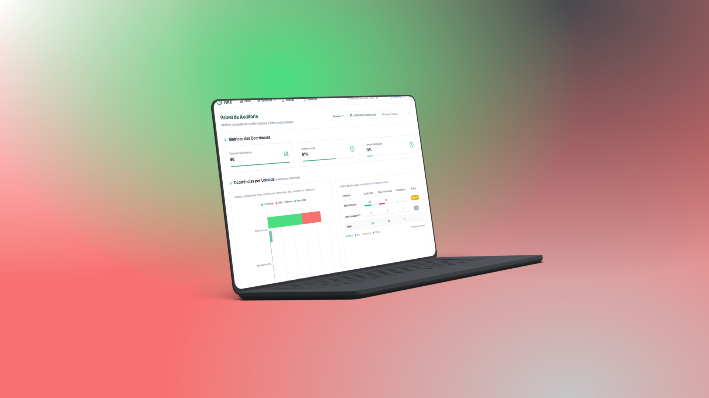
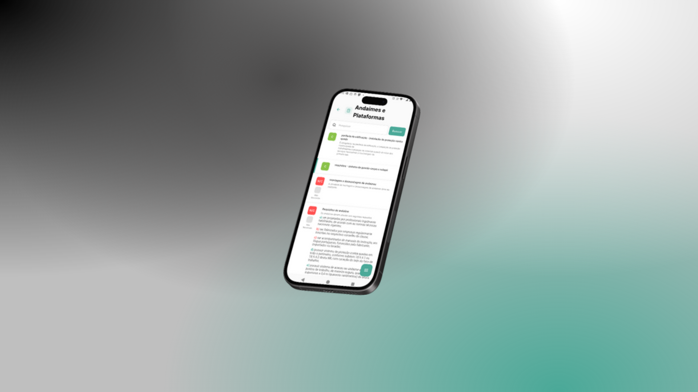
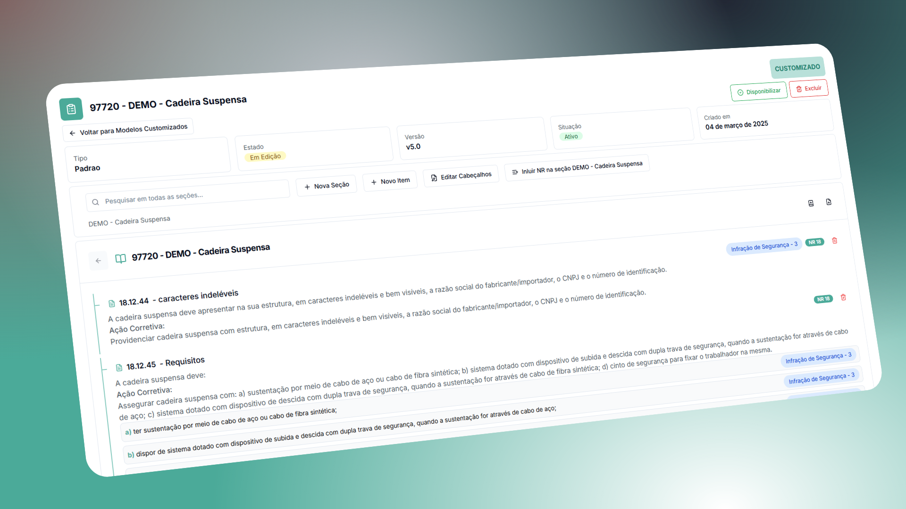
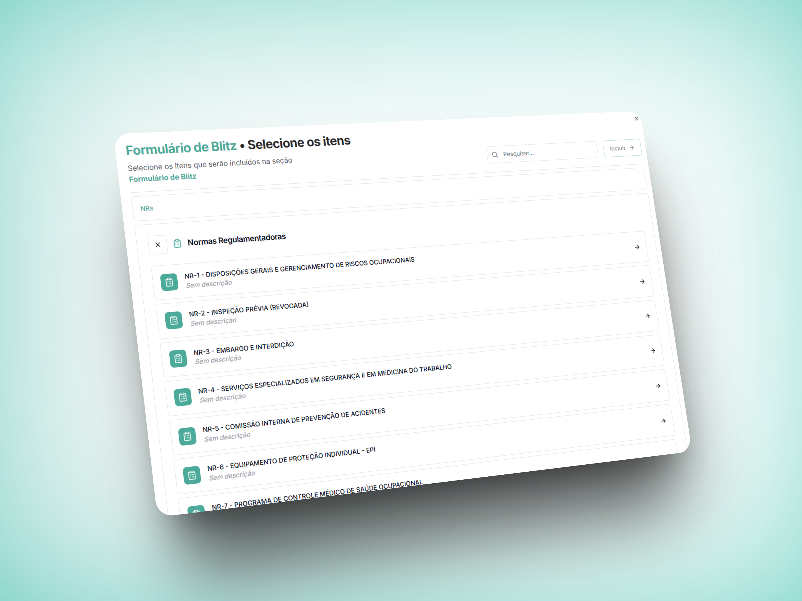

# Introdução às Auditorias

O módulo de Auditorias GNRx é uma solução completa para criação, execução e gestão de auditorias e inspeções de segurança, qualidade e conformidade. Desenvolvido para atender às necessidades específicas de empresas comprometidas com a excelência operacional e o cumprimento de normas regulamentadoras, o sistema oferece uma abordagem moderna e eficiente para processos de verificação.

.png>)

## Visão Geral do Módulo

O módulo de Auditorias GNRx permite gerenciar todo o ciclo de vida das auditorias:

* **Criação de modelos personalizados** de checklist adaptados às necessidades da sua empresa
* **Criação de modelos baseados em Normas Regulamentadoras (NRs)** adaptados às necessidades da sua empresa
* **Execução de auditorias em campo** com suporte a evidências fotográficas e observações
* **Identificação e tratamento de não conformidades** com acompanhamento de ações corretivas
* **Geração de relatórios detalhados** para análise e documentação
* **Análise de tendências e indicadores** para melhoria contínua

## Plataformas Disponíveis

O sistema GNRX Auditorias está disponível em duas plataformas complementares:

### Sistema Web

O sistema web é a plataforma central, acessível através de qualquer navegador moderno, onde você pode:

* Criar e gerenciar modelos de checklist
* Visualizar todas as auditorias realizadas
* Analisar dados e gerar relatórios avançados
* Configurar e administrar o sistema
* Gerenciar usuários e permissões

### Aplicativo Mobile

O aplicativo mobile está disponível para dispositivos iOS e Android, permitindo:

* Realizar auditorias em campo, mesmo sem conexão à internet
* Capturar fotos e evidências diretamente no local
* Sincronizar dados com o sistema central quando conectado
* Consultar auditorias anteriores para referência
* Coletar assinaturas digitais dos responsáveis

> **INTEGRAÇÃO PERFEITA**: As duas plataformas trabalham em sincronia, permitindo preparar auditorias no sistema web, realizá-las em campo com o aplicativo, e depois analisar os resultados novamente no sistema web.

## Principais Benefícios

### Eficiência Operacional

* **Redução de tempo**: Eliminação de processos manuais em papel
* **Centralização**: Todas as informações em um único sistema
* **Padronização**: Modelos consistentes para toda a organização
* **Mobilidade**: Realização de auditorias em qualquer local

### Conformidade Aprimorada

* **Evidência documentada**: Registro fotográfico de conformidades e não conformidades
* **Rastreabilidade**: Histórico completo de todas as auditorias
* **Cumprimento regulatório**: Alinhamento com normas e requisitos legais
* **Auditabilidade**: Pronta resposta a fiscalizações e auditorias externas

### Gestão Inteligente

* **Visibilidade**: Dashboards e indicadores para acompanhamento em tempo real
* **Análises**: Identificação de tendências e áreas problemáticas
* **Proatividade**: Antecipação de problemas antes que causem impactos
* **Melhoria contínua**: Base para evolução constante dos processos

## Fluxo de Trabalho Típico

O fluxo de trabalho padrão no módulo de Auditorias GNRx segue estas etapas:

1. **Planejamento**: Definição do escopo, locais e cronograma das auditorias
2. **Preparação**: Seleção ou criação dos modelos de checklist adequados
3. **Execução**: Realização da auditoria em campo com registro de evidências
4. **Análise**: Identificação de não conformidades e definição de ações corretivas
5. **Acompanhamento**: Monitoramento da implementação das correções
6. **Verificação**: Confirmação da eficácia das ações implementadas
7. **Relatórios**: Documentação dos resultados e compartilhamento com stakeholders

## Tipos de Auditoria Suportados

O sistema GNRx Auditorias é versátil e pode ser utilizado para diversos tipos de verificações:

* **Auditorias de Segurança**: Verificação de condições de trabalho seguras
* **Inspeções de Qualidade**: Controle de processos e produtos
* **Verificações de Conformidade Regulatória**: Atendimento a normas como NRs, ISO, etc.
* **Avaliações de Fornecedores**: Qualificação e monitoramento de terceiros
* **Inspeções de Equipamentos**: Verificação de condições e funcionalidade
* **Auditorias Ambientais**: Verificação de requisitos e impactos ambientais
* **Vistorias Prediais**: Avaliação de instalações e infraestrutura

## Recursos Principais

### Modelos Personalizáveis

Crie checklists completamente adaptados às necessidades específicas da sua operação:

* Editor intuitivo com estrutura hierárquica
* Suporte a diferentes tipos de respostas (sim/não, múltipla escolha, escalas)
* Organização em seções e subseções para melhor navegação
* Importação e exportação de modelos para reutilização
* Versionamento para controle de alterações

### Biblioteca de Normas Regulamentadoras

### Gestão de Não Conformidades

Sistema completo para tratamento de problemas identificados:

* Registro detalhado de não conformidades
* Classificação por nível de criticidade
* Atribuição de responsáveis e prazos
* Acompanhamento de status e implementação
* Registro de evidências de correção
* Notificações automáticas de prazos

### Relatórios e Análises

Ferramentas avançadas para visualização e compartilhamento de dados:

* Relatórios personalizáveis em diversos formatos
* Dashboards interativos com KPIs de desempenho
* Gráficos e visualizações para análise de tendências
* Comparativos entre períodos, unidades e tipos de auditoria
* Envio automático de relatórios por email

## Níveis de Acesso e Permissões

O sistema permite configurar diferentes níveis de acesso conforme as responsabilidades de cada usuário:

* **Admin**: Configuração completa do sistema e gestão de usuários
* **Gestor**: Criação de modelos e visualização de todas as auditorias
* **Supervisor**: Realização de auditorias e visualização das próprias auditorias
* **Operador**: Visualização e tratamento de não conformidades atribuídas

## Requisitos Técnicos

### Sistema Web

* **Navegadores compatíveis**: Chrome, Firefox, Safari, Edge (versões recentes)

### Aplicativo Mobile

* **Dispositivos iOS**: iPhone ou iPad com iOS 15.0 ou superior
* **Dispositivos Android**: Android 11.0 ou superior
* **Espaço em disco**: Mínimo 50 MB disponíveis
* **Câmera**: Recomendada resolução de 5 MP ou superior

## Próximos Passos

Agora que você conhece os fundamentos do módulo de Auditorias GNRx, explore as seções específicas deste manual para aprender a utilizá-lo em todo seu potencial:

* [Aplicativo Mobile de Auditorias](aplicativo/)
* [Sistema Web de Auditorias](web/)
