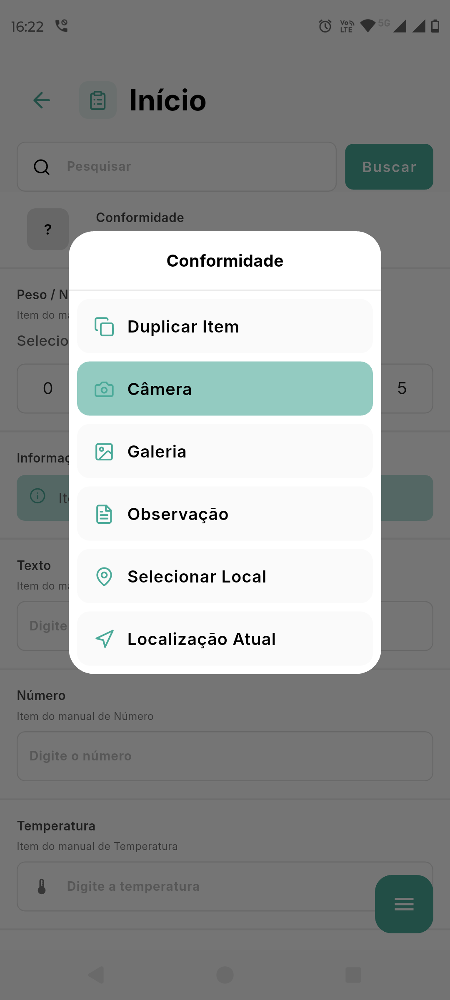
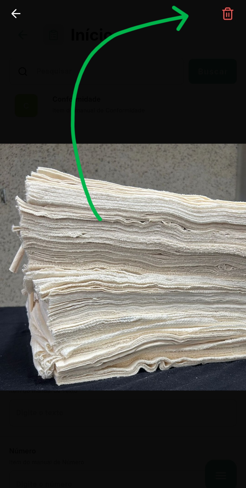

# Como Tirar Fotos e Anexar Evidências

A documentação fotográfica é um componente essencial para auditorias eficazes, fornecendo evidências visuais das conformidades e não conformidades encontradas. O aplicativo GNRX Auditorias oferece recursos avançados para captura e organização de fotos diretamente vinculadas aos itens do checklist.

## Importância das Evidências Fotográficas

As fotos em uma auditoria servem para:

* Documentar objetivamente situações de não conformidade
* Comprovar boas práticas e itens conformes
* Fornecer contexto visual para observações escritas
* Servir como referência para verificações futuras
* Aumentar a credibilidade e o valor dos relatórios

## Adicionando Fotos aos Itens

Para adicionar fotos a um item durante o preenchimento da auditoria:

1. Localize o item ao qual deseja anexar a foto
2. Toque em qualquer local do item desejado
3. Você verá um menu menu com várias opções, mas temos 2 principais para adicionar fotos:
   * **Câmera**: Abre a câmera para capturar uma nova imagem
   * **Galeria**: Permite escolher uma imagem já existente no dispositivo

## Capturando Novas Fotos

Para capturar uma nova foto diretamente no aplicativo:

1. Toque na opção "Câmera"
2. A câmera do dispositivo será ativada
3. Enquadre o objeto ou área que deseja fotografar
4. Alguns recursos disponíveis na tela da câmera:
   * Flash: Ative/desative conforme necessário
5. Toque no botão de captura para tirar a foto
6. A imagem irá processar, trazendo já a informação da data/hora e a localização
7. Verifique a imagem na tela de pré-visualização:
   * Se não estiver satisfeito, toque em "Descartar" e tente novamente
   * Se a foto estiver adequada, toque em "Usar foto"

> **DICAS PARA FOTOS DE QUALIDADE**:
>
> * Mantenha a câmera estável para evitar fotos tremidas
> * Certifique-se de que há iluminação adequada
> * Fotografe de um ângulo que mostre claramente o problema ou situação
> * Em ambientes escuros, use o flash, mas cuidado com reflexos em superfícies brilhantes

## Editando e Anotando Fotos

Após capturar uma foto, você pode adicionar marcações:

1. Após tirar a foto, e estiver na tela de confirmação, toque no ícone de lápis no canto superior direito
2. Use as ferramenta de **Desenho livre** para contornar ou destacar formas irregulares ou pontos de interesse
3. Ajuste a cor das marcações para garantir visibilidade
   * Verde geralmente é usado para destacar conformidades
   * Vermelho geralmente é usado para destacar não conformidades
4. Caso não queira o desenho mais, clique no botão com o ícone de "x". Isso removerá todas as marcações.
5. Toque em "Salvar" para confirmar as edições e anexar a foto ao item

.png>)

## Selecionando Fotos da Galeria

Para usar imagens já existentes no dispositivo:

1. Toque na opção "Selecionar da galeria"
2. O aplicativo abrirá o gerenciador de fotos do dispositivo
3. Navegue pelas pastas para encontrar a imagem desejada
4. Toque na imagem para selecioná-la
5. Confirme a seleção tocando em "Usar foto" ou botão similar

> **IMPORTANTE**: Ao selecionar imagens da galeria, certifique-se de que são fotos recentes e relevantes para a auditoria atual. O uso de fotos antigas ou de outros locais pode comprometer a integridade da auditoria.

## Excluindo Fotos

Para excluir uma foto:

1. Garanta que nas opções, "exibir fotos na listagem" esteja ativo
2. Na listem dos itens, clique na foto que deseja excluir
3. No canto superior direito, clique no ícone de lixeira

## Compressão e Armazenamento de Fotos

Para otimizar o uso de armazenamento, facilitar e agilizar a sincronização o aplicativo comprime automaticamente as fotos antes de salvá-las.

## Considerações sobre o Modo Offline

Quando estiver trabalhando sem conexão à internet:

1. Todas as fotos são armazenadas localmente no dispositivo
2. O espaço de armazenamento disponível pode limitar a quantidade de fotos que podem ser tiradas
3. Fotos tiradas offline são transferidas para o servidor durante a sincronização
4. O tempo de sincronização aumenta proporcionalmente à quantidade de fotos

> **IMPORTANTE**: Se você estiver realizando uma auditoria extensa com muitas fotos, monitore o espaço disponível no dispositivo e sincronize periodicamente quando tiver conexão, em vez de acumular todas as fotos para sincronização no final.

## Boas Práticas para Documentação Fotográfica

Para maximizar a eficácia das evidências fotográficas:

1. **Seja metodológico**: Fotografe itens na mesma ordem em que aparecem no checklist
2. **Capture antes e depois**: Quando possível, documente a situação antes e após a correção
3. **Contextualização**: Tire uma foto mais ampla para mostrar o contexto, seguida de fotos de detalhes
4. **Legibilidade**: Certifique-se de que textos, etiquetas ou números de série estão legíveis
5. **Privacidade**: Evite fotografar pessoas identificáveis, a menos que tenha consentimento
6. **Consistência**: Use ângulos e distâncias similares para itens comparáveis
7. **Iluminação adequada**: Tenha uma lanterna disponível para áreas com pouca luz e o flash não for o suficiente

## Solução de Problemas Comuns

### A câmera não abre ou fecha inesperadamente

* Verifique se o aplicativo tem permissão para acessar a câmera
* Feche outros aplicativos que possam estar usando a câmera
* Reinicie o dispositivo se o problema persistir

### Fotos salvas não aparecem na auditoria

* Verifique se a opção de "exibir fotos na listagem" está ativada
  * Menu (Botão do canto inferior direito) -> Configurações (Botão de engrenagem) -> Exibir fotos na listagem
* Verifique se a foto foi realmente salva
* Tente salvar a auditoria e reabri-la
* Certifique-se de que há espaço suficiente no armazenamento do dispositivo

### Fotos com qualidade muito baixa

* Limpe a lente da câmera do dispositivo
* Certifique-se de que há iluminação adequada
* Mantenha a câmera estável durante a captura

### Erro "Armazenamento insuficiente"

* Libere espaço excluindo arquivos desnecessários
* Sincronize periodicamente para poder excluir a fotos localmente. (Elas não serão removidas do sistema web)

## Próximos Passos

Após adicionar fotos aos itens de sua auditoria, você pode complementar a documentação com observações detalhadas:

* [Como Adicionar Observações](adicionar-observacoes.md)
* [Sincronizar com o Servidor](sincronizar.md)
