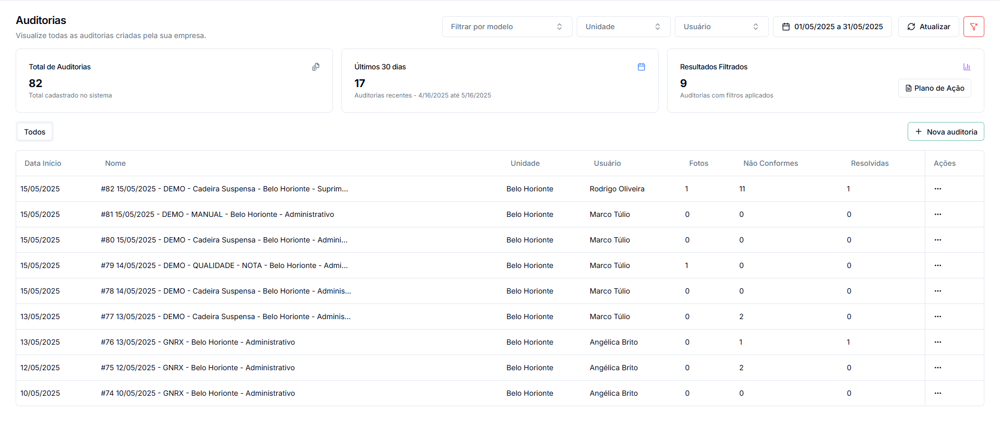
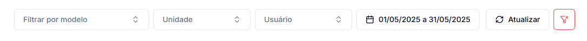

# Minhas Auditorias

A seção "Auditorias" centraliza todas as auditorias criadas na sua empresa, permitindo visualizar, filtrar e gerenciar de maneira eficiente todo o histórico de verificações realizadas.

## Acesso e Visão Geral

Acesse "Auditorias" através do menu lateral para visualizar um dashboard completo com:

* **Total de Auditorias**: Número total de auditorias cadastradas no sistema
* **Auditorias Recentes**: Quantidade de auditorias realizadas nos últimos 30 dias
* **Resultados Filtrados**: Número de auditorias que correspondem aos filtros aplicados

## Tabela de Auditorias

A tabela principal exibe todas as auditorias com informações essenciais organizadas em colunas:

* **Data Início**: Data em que a auditoria foi realizada
* **Nome**: Identificação da auditoria com código e descrição
* **Unidade**: Local onde a auditoria foi realizada
* **Usuário**: Responsável pela realização da auditoria
* **Fotos**: Quantidade de evidências fotográficas registradas
* **Não Conformes**: Número de itens identificados como não conformes
* **Resolvidas**: Quantidade de não conformidades já solucionadas
* **Ações**: Menu de opções disponíveis para cada auditoria

## Filtros Avançados

Utilize os filtros disponíveis no topo da página para localizar auditorias específicas:

* **Filtrar por modelo**: Selecione um modelo específico de checklist
* **Unidade**: Filtre por local onde as auditorias foram realizadas
* **Usuário**: Encontre auditorias realizadas por um usuário específico
* **Período**: Defina um intervalo de datas para busca

Após configurar os filtros desejados, clique em **"Atualizar"** para aplicá-los.

## Recursos Disponíveis

### Plano de Ação Consolidado

Um dos recursos mais úteis é a geração de planos de ação consolidados para múltiplas auditorias:

1. Aplique os filtros desejados para selecionar um conjunto de auditorias
2. Observe o número de "Resultados Filtrados" que aparece
3. Clique no botão **"Plano de Ação"** ao lado do número de resultados
4. Selecione o tipo de plano desejado (A ou B) no modal que aparece
5. O sistema gerará um plano consolidado com as não conformidades de todas as auditorias filtradas

### Nova Auditoria

Para iniciar uma nova verificação:

1. Clique no botão **"Nova auditoria"** no canto superior direito da tela
2. Você será direcionado para o [modal de criação de auditoria](criar-auditoria.md), onde poderá configurar todos os parâmetros necessários

## Visualização e Análise

### Indicadores Visuais

O dashboard inicial apresenta indicadores visuais importantes:

* **Total cadastrado**: Número total de auditorias no sistema
* **Auditorias recentes**: Quantidade de verificações nos últimos 30 dias
* **Resultados filtrados**: Número de auditorias que atendem aos critérios de filtro aplicados

### Detalhes da Auditoria

Para acessar os detalhes completos de uma auditoria:

1. Localize a auditoria desejada na tabela
2. Clique sobre o nome da auditoria para abrir a visualização detalhada
3. Ou use o menu de ações (três pontos) na coluna "Ações" para ver as opções disponíveis

### Status Visual das Auditorias

A tabela fornece indicadores visuais rápidos sobre o status de cada auditoria:

* **Fotos**: Número de evidências fotográficas coletadas
* **Não Conformes**: Quantidade de itens que precisam de atenção
* **Resolvidas**: Progresso na resolução das não conformidades

## Dicas de Utilização

* 💡 **Dica 1**: Combine filtros diferentes para encontrar exatamente o que você precisa
* 💡 **Dica 2**: Use o filtro de período para análises mensais ou trimestrais
* 💡 **Dica 3**: Gere planos de ação consolidados para áreas específicas, facilitando a distribuição de responsabilidades
* 💡 **Dica 4**: Verifique regularmente as auditorias com não conformidades pendentes

## Próximos Passos

* [Criar uma nova auditoria](criar-auditoria.md)
* [Emitir planos de ação](emitir-plano-acao.md)
* [Verificar relatórios detalhados](relatorio-auditoria.md)
