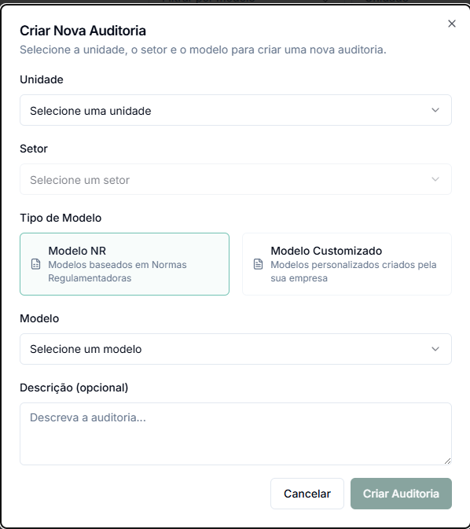

# Criar Auditoria

O sistema web GNRX Auditorias permite criar novas auditorias de forma rápida e intuitiva, seguindo um fluxo simples de configuração que garante a coleta de todas as informações necessárias.

## Acessando a Criação de Auditoria

Existem duas formas de iniciar o processo de criação de uma nova auditoria:

1. Na lista de auditorias, clique no botão **"Nova auditoria"** no canto superior direito
2. No Dashboard, use o botão de criação rápida de auditoria

Ambas as opções abrirão o modal de configuração da nova auditoria.

## Passo a Passo para Criar uma Auditoria

O processo de criação segue uma sequência lógica que orienta você na configuração completa da auditoria:

### 1. Selecionar Unidade

* Clique no campo **"Selecione uma unidade"**
* Escolha a unidade onde a auditoria será realizada
* A lista exibirá apenas as unidades às quais você tem acesso


Caso a unidade desejada não apareça na lista, é necessário que o administrador do sistema conceda acesso a esta unidade para o seu usuário.


### 2. Selecionar Setor

* Após selecionar a unidade, escolha o **setor específico**
* A lista mostrará os setores disponíveis na unidade selecionada
* Este campo ajuda a especificar exatamente onde a verificação será feita

### 3. Escolher o Tipo de Modelo

O sistema oferece duas opções de modelos:

* **Modelo NR**: Baseado em Normas Regulamentadoras oficiais
  * Ideal para verificar conformidade com requisitos legais
  * Contém estrutura e classificação de infrações padronizadas
* **Modelo Customizado**: Criado especificamente para sua empresa
  * Personalizado para processos e necessidades específicos
  * Flexibilidade na estrutura e tipos de resposta

Esta seleção funciona como um filtro para a próxima etapa.

### 4. Selecionar o Modelo Específico

* Clique no campo **"Selecione um modelo"**
* Escolha o modelo específico que será utilizado na auditoria
* Apenas os modelos do tipo selecionado anteriormente (NR ou Customizado) serão exibidos

### 5. Adicionar Descrição (opcional)

* Campo livre para incluir informações adicionais sobre o propósito da auditoria
* Detalhes sobre o contexto específico, motivação ou circunstâncias especiais
* Este campo é opcional, mas pode ser útil para futuras consultas

## Criando a Auditoria

Após preencher todas as informações necessárias:

1. Verifique se todos os campos obrigatórios foram preenchidos corretamente
2. Clique no botão **"Criar Auditoria"**
3. Caso precise cancelar a operação, clique em **"Cancelar"**

Após a criação, o sistema abrirá automaticamente a tela de preenchimento do checklist ou apresentará campos adicionais específicos do modelo selecionado.

## Preenchimento do Cabeçalho

Dependendo do modelo selecionado, o sistema pode solicitar informações adicionais de cabeçalho:

* Estas informações são específicas para cada tipo de auditoria
* Campos marcados com asterisco (\*) são obrigatórios
* O preenchimento correto destes campos é essencial para a validade da auditoria

## Nome da Auditoria

Por padrão, o sistema gera automaticamente um nome para a auditoria seguindo o formato:

* **Padrão**: Data - Nome do Modelo - Unidade - Setor

Você pode personalizar este nome após a criação da auditoria, caso necessário.

## Considerações Importantes

### Permissões de Acesso

* Você só poderá criar auditorias nas unidades e setores aos quais tem acesso
* O administrador do sistema define estas permissões para cada usuário
* Caso precise de acesso a unidades adicionais, entre em contato com o administrador

### Modelos Disponíveis

* Apenas modelos ativos e em estado "Disponível" aparecem na lista de seleção
* Modelos em estado de "Rascunho" ou "Inativo" não são exibidos
* Para usar um novo modelo, certifique-se de que ele foi finalizado e disponibilizado

### Continuidade do Processo

Após a criação da auditoria, você pode:

* Iniciar o preenchimento imediatamente
* Salvar para continuar posteriormente (a auditoria ficará com status "Em Andamento")
* Adicionar outros usuários como participantes da auditoria (se tiver permissão)

## Solução de Problemas Comuns

### Não consigo ver uma unidade específica

* Verifique se você tem permissão para acessar esta unidade
* Solicite ao administrador a concessão de acesso se necessário

### Não encontro o modelo desejado

* Confirme se está buscando no tipo correto (NR ou Customizado)
* Verifique se o modelo está no estado "Disponível"
* Consulte o administrador para confirmar que o modelo está ativo

### Erro ao criar a auditoria

* Verifique se todos os campos obrigatórios foram preenchidos
* Confirme sua conexão com a internet
* Tente novamente após alguns instantes
* Se o problema persistir, contate o suporte técnico

## Próximos Passos

Após criar sua auditoria, você estará pronto para começar o preenchimento:

* [Preencher uma auditoria](preencher-auditoria.md)
* [Gerenciar auditorias existentes](auditorias.md)
* [Visualizar relatórios](relatorio-auditoria.md)
