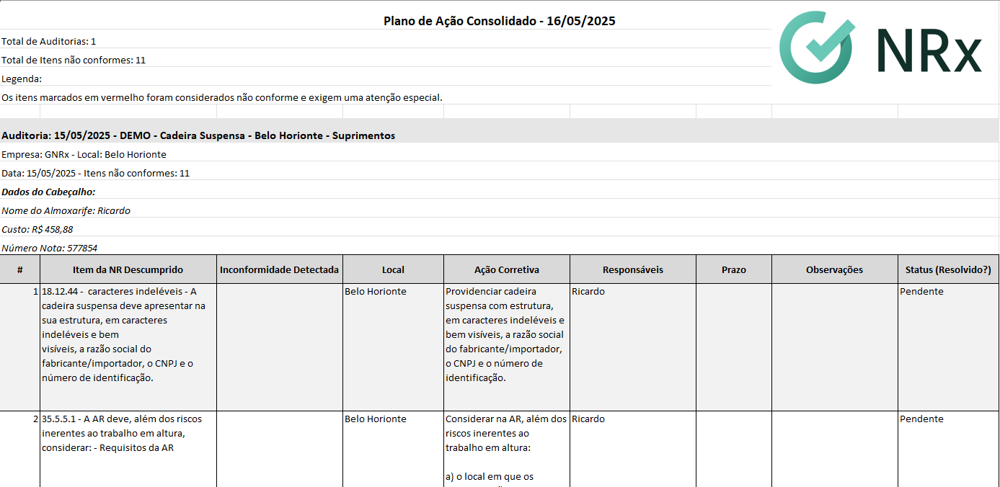
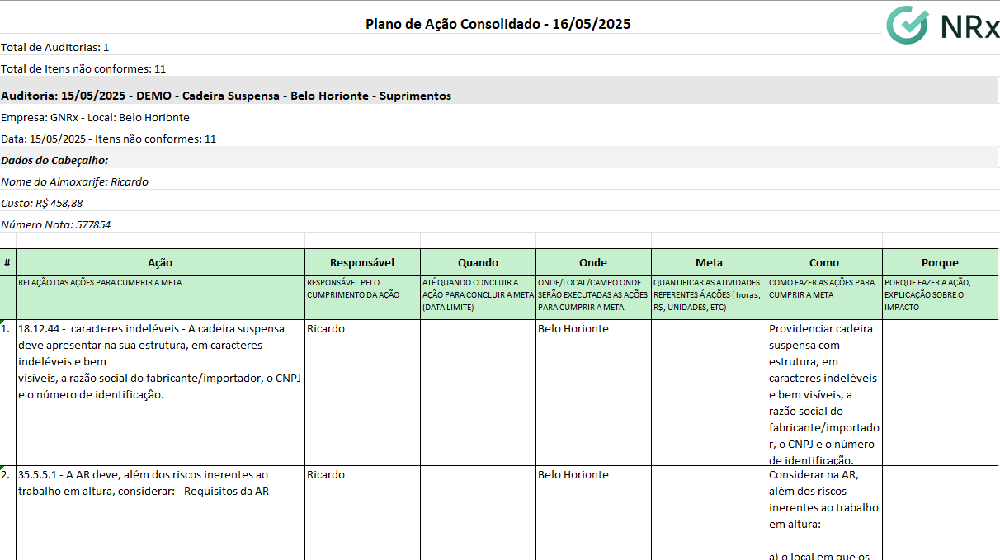

# Emitir Plano de Ação

Os Planos de Ação são ferramentas essenciais para tratamento das não conformidades identificadas nas auditorias, permitindo acompanhar e garantir a implementação de medidas corretivas.

## Tipos de Planos de Ação

O sistema GNRx Auditorias oferece dois formatos de planos de ação:

| Plano de Ação A                                                      | Plano de Ação B                                                 |
| -------------------------------------------------------------------- | --------------------------------------------------------------- |
| Formato simples, focado em listar não conformidades e suas correções | Formato estruturado, organizado como projeto com abordagem 5W2H |
| Exibe apenas as não conformidades identificadas na auditoria         | Permite planejamento detalhado com metas, prazos e responsáveis |
| Layout em formato de tabela tradicional                              | Layout com campos específicos para cada elemento do 5W2H        |
| Ideal para correções pontuais e diretas                              | Recomendado para ações complexas que exigem coordenação         |

## Emitindo Plano de Ação para uma Auditoria Específica

### Acesso pela Página da Auditoria

1. Acesse a auditoria concluída na qual deseja criar um plano de ação
2. No topo da página, localize os botões de ação disponíveis
3. Clique em **"Plano de Ação A"** ou **"Plano de Ação B"** conforme sua necessidade

### Conteúdo do Plano de Ação A

O Plano de Ação A é exibido em formato de tabela com as seguintes colunas:

* **Item da NR Descumprido**: Identificação do item não conforme
* **Inconformidade Detectada**: Descrição da não conformidade
* **Local**: Onde a não conformidade foi identificada
* **Ação Corretiva**: Medida a ser implementada
* **Responsáveis**: Pessoa designada para corrigir
* **Prazo**: Data limite para implementação
* **Observações**: Campo para comentários adicionais
* **Status**: Situação atual (Pendente, Em andamento, Concluído)

### Conteúdo do Plano de Ação B

O Plano de Ação B segue a metodologia 5W2H, com as seguintes colunas:

* **Ação**: O que precisa ser feito (item não conforme)
* **Responsável**: Quem irá executar a ação (Who)
* **Quando**: Prazo para execução (When)
* **Onde**: Local de implementação (Where)
* **Meta**: Objetivo a ser alcançado (What)
* **Como**: Método de implementação (How)
* **Porque**: Justificativa da ação (Why)


Atualmente, os planos de ação são gerados em formato Excel, facilitando a edição, compartilhamento e acompanhamento offline quando necessário.


## Emitindo Plano de Ação para Múltiplas Auditorias

Um diferencial importante do sistema é a possibilidade de gerar planos de ação consolidados para várias auditorias de uma só vez:

1. Na lista de auditorias, utilize os filtros disponíveis para selecionar as auditorias desejadas:
   * Filtrar por modelo
   * Filtrar por unidade
   * Filtrar por usuário
   * Filtrar por período
2. Após aplicar os filtros, o sistema exibirá o número de auditorias encontradas
3. Clique no botão **"Plano de Ação"** que aparece nos resultados filtrados
4. No modal que será aberto, selecione o tipo de plano desejado (A ou B)
5. O sistema gerará um plano de ação consolidado com todas as não conformidades das auditorias selecionadas

## Estrutura dos Planos Consolidados

Os planos de ação consolidados incluem:

* **Cabeçalho com informações gerais**:
  * Data de geração do plano
  * Total de auditorias incluídas
  * Total de itens não conformes
* **Detalhamento por auditoria**:
  * Nome e código de cada auditoria
  * Local e data da realização
  * Dados do cabeçalho da auditoria original
* **Lista completa de não conformidades**:
  * Organizadas por auditoria
  * Mantendo a estrutura do tipo de plano selecionado (A ou B)

## Benefícios dos Planos de Ação

* **Padronização**: Formato consistente para tratamento de não conformidades
* **Rastreabilidade**: Vinculação clara entre não conformidades e ações corretivas
* **Responsabilização**: Definição de responsáveis por cada ação
* **Priorização**: Possibilidade de ordenar ações por criticidade
* **Gestão visual**: Acompanhamento fácil do status de implementação

## Utilização e Acompanhamento

Após a geração do plano de ação em Excel:

1. **Compartilhe** o plano com os responsáveis pelas ações
2. **Defina** prazos realistas para implementação
3. **Acompanhe** o progresso periodicamente
4. **Atualize** o status das ações conforme são implementadas
5. **Verifique** a eficácia das ações implementadas

## Dicas de Utilização

* 💡 **Dica 1**: Para não conformidades simples e diretas, utilize o Plano de Ação A
* 💡 **Dica 2**: Para tratativas mais complexas que envolvem múltiplas etapas, opte pelo Plano de Ação B
* 💡 **Dica 3**: Ao gerar planos consolidados, agrupe auditorias com temas relacionados
* 💡 **Dica 4**: Utilize os filtros por período para acompanhar não conformidades recorrentes

## Próximos Passos

* [Visualizar relatórios de auditoria](relatorio-auditoria.md)
* [Criar nova auditoria de verificação](criar-auditoria.md)
* [Analisar tendências no Dashboard](painel.md)
