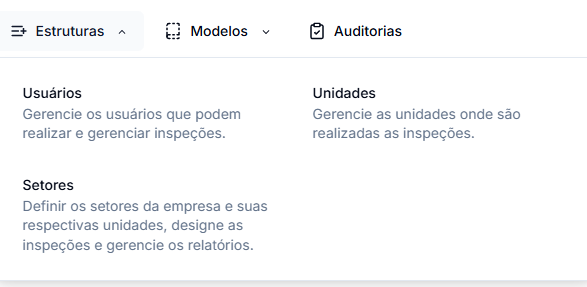

# Estruturas

O módulo Estruturas é a base para organização e funcionamento do sistema GNRX Auditorias, fornecendo os elementos fundamentais para gerenciar auditorias e inspeções.

## Componentes Principais

O sistema é organizado em três componentes estruturais básicos:

| Componente   | Descrição                                                     | Documentação Detalhada           |
| ------------ | ------------------------------------------------------------- | -------------------------------- |
| **Usuários** | Gerencia os usuários que podem realizar e gerenciar inspeções | [Manual de Usuários](usuario.md) |
| **Unidades** | Configura os locais onde são realizadas as inspeções          | [Manual de Unidades](unidade.md) |
| **Setores**  | Define as áreas específicas dentro de cada unidade            | [Manual de Setores](setor.md)    |

## Visão Geral

### Usuários

Gerencia as pessoas que podem acessar o sistema para realizar e gerenciar auditorias.

**Principais funcionalidades:**

* Cadastro e gerenciamento de usuários
* Definição de níveis de acesso e permissões
* Atribuição de unidades e setores específicos

Para instruções detalhadas sobre gerenciamento de usuários, consulte o [Manual de Usuários](usuario.md).

### Unidades

Administra os locais físicos onde as inspeções são realizadas, como filiais, fábricas ou escritórios.

**Principais funcionalidades:**

* Cadastro de unidades com endereço completo
* Configuração de parâmetros específicos por unidade
* Vinculação com setores correspondentes

Para instruções detalhadas sobre gerenciamento de unidades, consulte o [Manual de Unidades](unidade.md).

### Setores

Configura as áreas específicas dentro de cada unidade, permitindo organização detalhada das inspeções.

**Principais funcionalidades:**

* Definição de setores específicos da empresa
* Vinculação de setores às respectivas unidades
* Designação de inspeções por setor específico

Para instruções detalhadas sobre gerenciamento de setores, consulte o [Manual de Setores](setor.md).

## Relação entre Componentes

A estrutura hierárquica funciona de forma integrada:

1. **Usuários** têm permissões para acessar determinadas **Unidades**
2. **Unidades** contêm diferentes **Setores**
3. **Auditorias** são realizadas em **Setores** específicos de cada **Unidade**

Esta organização facilita análises comparativas e relatórios consolidados em diferentes níveis.

## Próximos Passos

Após configurar a estrutura básica do sistema:

* [Crie modelos de auditoria](../modelo-customizado.md)
* [Inicie novas auditorias](../criar-auditoria.md)
* [Gere relatórios de conformidade](../relatorio-auditoria.md)
