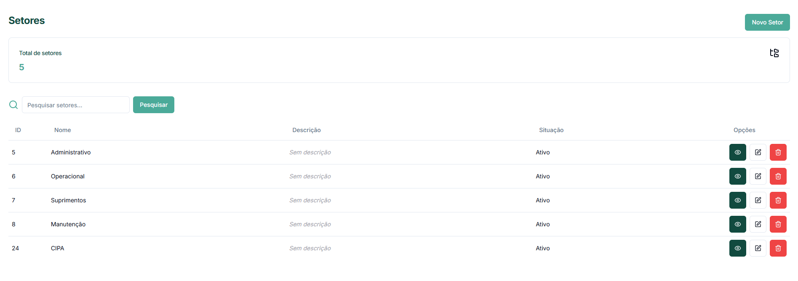
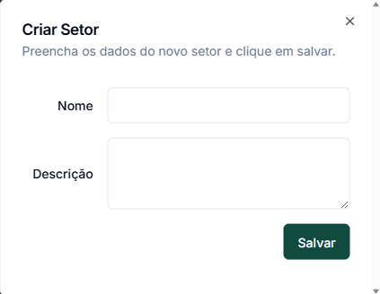

# Setores

Os Setores representam as áreas específicas dentro das unidades onde são realizadas as auditorias. A correta configuração dos setores permite uma organização eficiente das inspeções e relatórios mais detalhados.

## Visão Geral da Tela de Setores

A tela principal de Setores exibe:

* **Total de setores**: Número total de setores cadastrados no sistema
* **Lista de setores**: Tabela com todos os setores e suas informações principais

## Criando um Novo Setor

O processo de criação de um setor é simples e direto:

1. Na tela de Setores, clique no botão **"Novo Setor"** no canto superior direito
2. No modal "Criar Setor", preencha as informações:
   * **Nome**: Nome do setor (ex: Administrativo, Operacional, Manutenção, CIPA)
   * **Descrição** (opcional): Detalhes adicionais sobre o setor e suas atividades
3. Clique em **"Salvar"** para confirmar a criação


Os setores são criados de forma independente das unidades. Um mesmo setor pode ser associado posteriormente a múltiplas unidades conforme necessário.


## Gerenciando Setores Existentes

### Visualizando Detalhes

Para visualizar os detalhes de um setor:

1. Na lista de setores, clique no ícone de visualização (olho) na coluna "Opções"
2. O sistema exibirá as informações detalhadas do setor

### Editando um Setor

Para modificar as informações de um setor:

1. Na lista de setores, clique no ícone de edição (lápis) na coluna "Opções"
2. No modal de edição, atualize o nome e/ou descrição conforme necessário
3. Clique em **"Salvar"** para confirmar as alterações

### Excluindo um Setor

Para remover um setor do sistema:

1. Na lista de setores, clique no ícone de exclusão (lixeira) na coluna "Opções"
2. Confirme a exclusão quando solicitado


Só é possível excluir setores que não estejam associados a nenhuma unidade ou auditoria. Caso o setor já esteja em uso, você deverá primeiro remover todas as associações.


## Associação com Unidades

Os setores criados precisam ser associados às unidades onde existem fisicamente. Esta associação é feita através do módulo de Unidades:

1. Acesse a tela de Unidades no menu principal
2. Clique no nome da unidade desejada para abrir os detalhes
3. Na seção "Setores", clique em **"Adicionar setor"**
4. Selecione o setor desejado na lista suspensa
5. Clique em **"Associar"** para vincular o setor à unidade

Um mesmo setor pode ser associado a várias unidades diferentes, permitindo:

* Padronização da nomenclatura de áreas similares em diferentes locais
* Análises comparativas de conformidade do mesmo setor em diferentes unidades
* Relatórios consolidados por tipo de setor

## Usando Setores nas Auditorias

Ao criar uma nova auditoria, o sistema solicitará a seleção de:

1. A unidade onde a auditoria será realizada
2. O setor específico dentro dessa unidade

Esta estrutura hierárquica permite:

* Direcionar auditorias para áreas específicas
* Filtrar relatórios por setor
* Identificar tendências de conformidade por tipo de setor
* Atribuir responsabilidades de forma mais precisa

## Setores e Relatórios

Nos emails para relatórios configurados nas unidades, é possível definir:

* Quais setores serão incluídos nos relatórios enviados para cada destinatário
* Se o email deverá receber relatórios de todos os setores ou apenas setores específicos
* Se cada setor requer assinatura eletrônica do destinatário

## Dicas para Gestão de Setores

* **Padronização de nomes**: Utilize uma nomenclatura consistente para setores similares
* **Descrições claras**: Adicione descrições que expliquem o escopo e função de cada setor
* **Estrutura organizada**: Crie setores que reflitam a organização real da empresa
* **Manutenção regular**: Revise periodicamente a lista de setores para manter a relevância

## Próximos Passos

Após configurar os setores e associá-los às unidades, você pode:

* [Gerenciar usuários do sistema](../../../web/usuario.md)
* [Criar modelos de checklist](../../../web/modelo-customizado.md)
* [Iniciar novas auditorias](../../../web/criar-auditoria.md)
