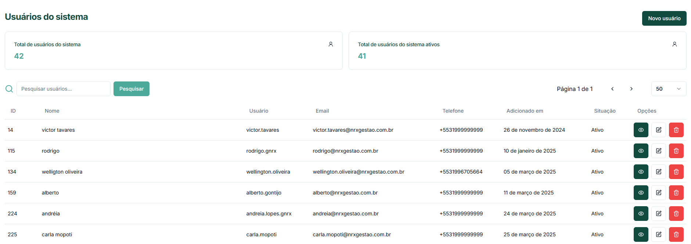
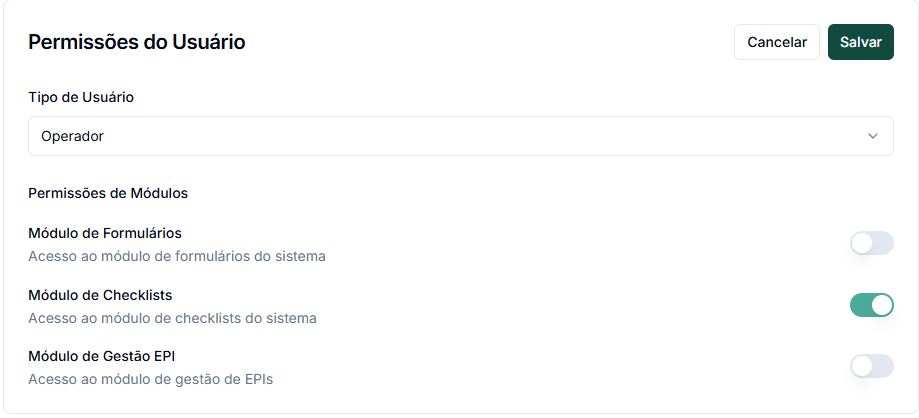
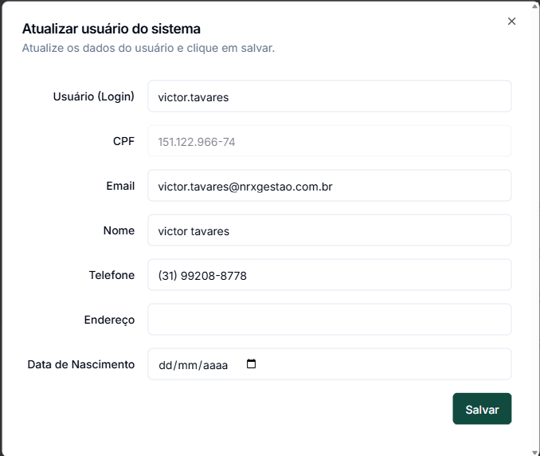

# Usuários

O módulo de Usuários permite gerenciar as pessoas que terão acesso ao sistema GNRX Auditorias, definindo suas permissões e unidades que podem acessar.

## Visão Geral da Tela de Usuários

A tela principal de Usuários exibe:

* **Total de usuários do sistema**: Número total de usuários cadastrados
* **Total de usuários ativos**: Usuários com status ativo que podem acessar o sistema
* **Lista de usuários**: Tabela com todos os usuários e suas informações principais

## Criando um Novo Usuário

Para adicionar um novo usuário ao sistema:

1. Na tela de Usuários, clique no botão **"Novo usuário"** no canto superior direito
2. Preencha as informações no formulário dividido em duas seções principais:

### Informações Pessoais

* **Usuário (Login)**: Nome de usuário para acesso ao sistema
* **Nome Completo**: Nome completo da pessoa
* **CPF** (Opcional): Documento de identificação
* **Data de Nascimento** (Opcional): Data de nascimento do usuário
* **Email**: Endereço de email (usado para comunicações)
* **Telefone**: Número para contato
* **Senha**: Senha inicial para acesso ao sistema
* **Endereço** (Opcional): Endereço completo

### Configurações de Acesso

* **Nível de Acesso**: Define o tipo de usuário
  * **Operador**: Usuário básico que pode realizar auditorias
  * **Supervisor**: Pode supervisionar auditorias e visualizar relatórios
  * **Gestor**: Acesso a recursos de gerenciamento e relatórios avançados
  * **Administrador**: Acesso completo ao sistema, incluindo gerenciamento de usuários

* **Módulos de Acesso**: Define a quais módulos do sistema o usuário terá acesso
  * **Formulários**: Acesso ao módulo de formulários
  * **Checklists**: Acesso ao módulo de checklists e auditorias
  * **Gestão EPI**: Acesso ao módulo de gestão de Equipamentos de Proteção Individual

3. Após preencher todas as informações, clique no botão **"Criar usuário"** na parte inferior da tela


Atualmente, apenas usuários com nível de acesso **Administrador** podem gerenciar outros usuários no sistema. Esta funcionalidade será expandida para outros perfis em atualizações futuras.


## Gerenciando Usuários Existentes

### Visualizando Usuários

A tabela de usuários mostra as seguintes informações:

* **ID**: Identificador único do usuário
* **Nome**: Nome completo
* **Usuário**: Nome de login
* **Email**: Endereço de email
* **Telefone**: Número para contato
* **Adicionado em**: Data de criação do cadastro
* **Situação**: Status atual (Ativo/Inativo)
* **Opções**: Botões de ação para gerenciar o usuário

### Ações Disponíveis

Para cada usuário, você pode:

* **Visualizar detalhes**: Clique no ícone de olho 👁️
* **Editar informações**: Clique no ícone de lápis ✏️
* **Inativar usuário**: Clique no ícone de lixeira 🗑️

### Editando um Usuário

Ao editar um usuário, você terá acesso a várias seções:

1. **Informações Pessoais**: Dados básicos do usuário
2. **Contato**: Email e telefone
3. **Empresa**: Informações relacionadas à empresa
4. **Datas**: Data de nascimento

### Permissões do Usuário

Na parte inferior da tela de edição, você encontrará as configurações de permissão:

1. **Tipo de Usuário**: Define o nível de acesso (Operador, Supervisor, Gestor, Administrador)
2. **Permissões de Módulos**: Controle quais módulos o usuário pode acessar
   * Módulo de Formulários
   * Módulo de Checklists (Auditorias)
   * Módulo de Gestão EPI


Usuários com perfil de Administrador não podem alterar as permissões de outros usuários administradores.



Usuários sem permissão a nenhum módulo não conseguem acessar o sistema.


### Atribuição de Unidades

Um dos aspectos mais importantes é a definição das unidades que o usuário poderá acessar:

1. Na seção **Unidades**, veja as unidades já atribuídas ao usuário
2. Clique no botão **"Editar"** para modificar as atribuições
3. Selecione as unidades que o usuário deve ter acesso
4. Um usuário só poderá criar e visualizar auditorias nas unidades atribuídas a ele


É essencial atribuir ao menos uma unidade ao usuário, caso contrário, ele não conseguirá utilizar o sistema corretamente.


## Alterando Senha de Usuário

Para alterar a senha de um usuário:

1. Acesse as informações do usuário
2. Clique no botão **"Alterar Senha"** no canto superior direito
3. Digite a senha.
   * A senha deve seguir as regras:
     * Deve conter pelo menos 8 caracteres
     * Deve conter letras maiúsculas
     * Deve conter letras minúsculas
     * Deve conter números
     * Não deve conter espaços
4. Digite a senha novamente, para confirmar.
5. Clique em "Salvar" para confirmar a alteração

## Pesquisando Usuários

Para localizar usuários específicos:

1. Use o campo de pesquisa no topo da lista
2. Digite parte do nome, email ou ID do usuário
3. Clique no botão **"Pesquisar"** ou pressione Enter

## Inativando um Usuário

Quando um usuário não deve mais acessar o sistema:

1. Acesse as informações do usuário
2. Altere o status para "Inativo"
3. Salve as alterações

Usuários inativos não podem fazer login no sistema, mas todas as auditorias e ações realizadas anteriormente permanecem no histórico.

## Dicas de Gerenciamento de Usuários

* **Nomeação consistente**: Adote um padrão para nomes de usuário (login)
  * Ex: rodrigo.gnrx | gnrx.rodrigo | rodrigo.castro
* **Permissões mínimas**: Conceda apenas os acessos necessários para cada função
* **Revisão periódica**: Avalie regularmente as permissões e usuários ativos
* **Documentação**: Mantenha um registro das atribuições de cada tipo de usuário
* **Segurança**: Oriente sobre práticas de senhas seguras e não compartilhe credenciais

## Próximos Passos

Após configurar os usuários do sistema, você pode:

* [Configurar unidades](unidade.md)
* [Configurar setores](setor.md)
