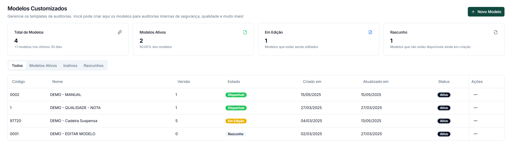
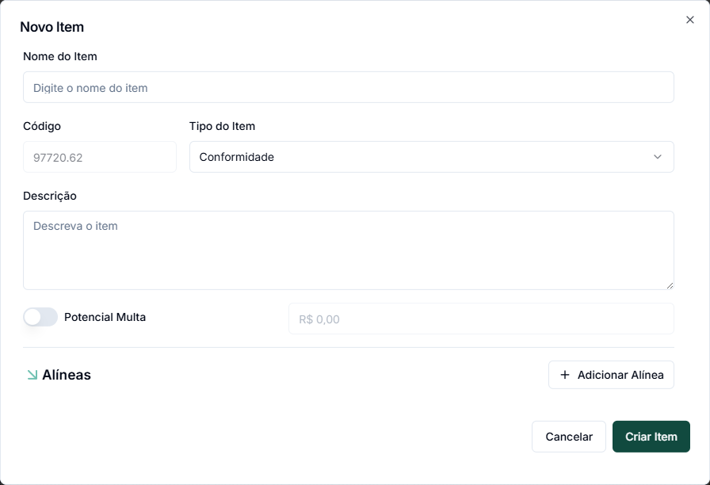
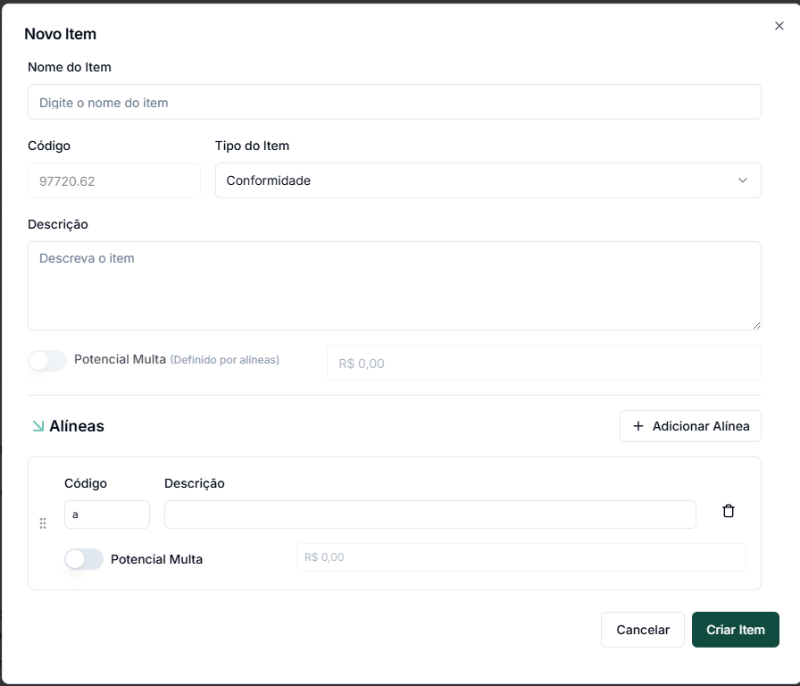
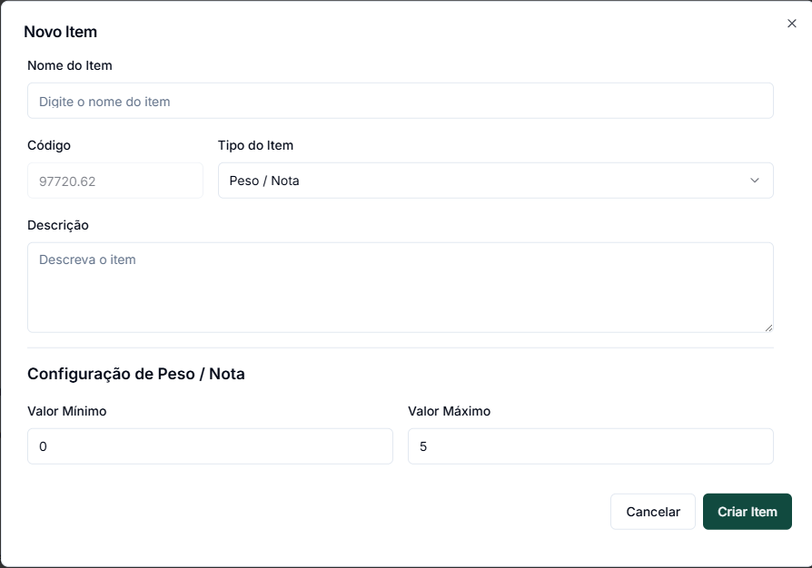
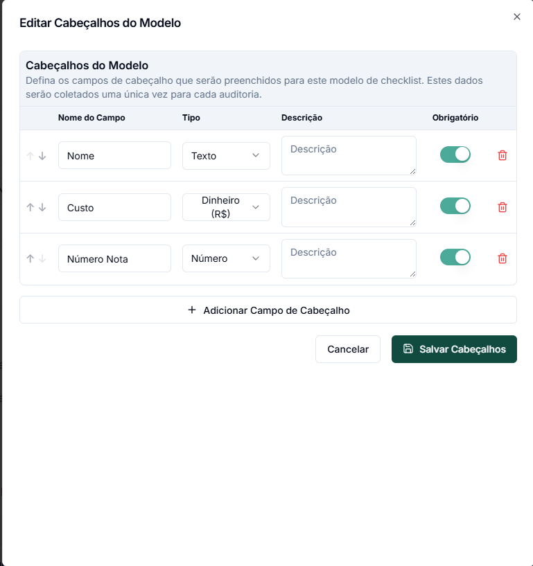

# Modelos Customizados

Os Modelos Customizados permitem criar checklists totalmente personalizados, adaptados às necessidades específicas da sua empresa, processos internos ou requisitos particulares do seu negócio.

## Vantagens dos Modelos Customizados

* **Flexibilidade total** na criação da estrutura e conteúdo
* **Múltiplos tipos de resposta** para diferentes necessidades de verificação
* **Hierarquia personalizada** com seções e itens organizados logicamente
* **Adaptação completa** aos processos e terminologia da sua empresa
* **Possibilidade de combinar** com itens de Normas Regulamentadoras (NRs)

## Ciclo de Vida de um Modelo Customizado

Os modelos customizados passam por diferentes estados durante seu ciclo de vida:

| Estado         | Descrição                                                                      |
| -------------- | ------------------------------------------------------------------------------ |
| **Rascunho**   | Versão inicial em desenvolvimento, ainda não disponível para uso em auditorias |
| **Em Edição**  | Modelo que está sendo modificado para uma nova versão                          |
| **Disponível** | Modelo finalizado e pronto para ser utilizado em auditorias                    |
| **Inativo**    | Modelo desativado que não aparece mais para seleção em novas auditorias        |

## Criando um Novo Modelo Customizado

### Passo 1: Iniciar a criação

1. No menu superior, acesse **"Modelos"** > **"Modelos Customizados"**
2. Clique no botão para criar um novo modelo
3. Preencha as informações básicas:
   * Nome do modelo
   * Descrição (opcional)
   * Tipo (Padrão ou outro específico)

### Passo 2: Configurar opções gerais

Defina as configurações iniciais do modelo:

* Opção de permitir fotos nas auditorias
* Opção de permitir observações nos itens

Após a criação inicial, o modelo ficará no estado **"Rascunho"** até ser disponibilizado.

## Estruturando seu Modelo

Um modelo vazio será exibido, pronto para adição de conteúdo. Você tem duas opções principais para estruturar seu modelo:

### Adicionando Seções

As seções funcionam como agrupamentos lógicos para organizar os itens do checklist:

1. Clique no botão **"Nova Seção"**
2. Defina:
   * Nome da seção (ex: "Cozinha", "Almoxarifado", "Área Externa")
   * Código - Automático (será usado para referenciar os itens da seção)
   * Descrição (opcional)
3. Salve a seção

### Adicionando Itens

Para criar os itens de verificação dentro de uma seção:

1. Clique no botão **"Novo Item"**
2. Na janela que aparece (como na Imagem 2), configure:
   * Nome do item (a pergunta ou verificação a ser realizada)
   * Código (gerado automaticamente)
   * Tipo do item (explicado na próxima seção)
   * Descrição detalhada
   * Opções específicas para o tipo selecionado

## Tipos de Itens Disponíveis

O sistema oferece diversos tipos de itens para diferentes necessidades de verificação:

### Conformidade

* **Funcionalidade**: Verifica se um requisito está Conforme, Não Conforme ou Não Aplicável
* **Características**:
  * Opção para definir "Potencial Multa" (para requisitos legais)
  * Possibilidade de adicionar "Alíneas" (subquesitos com conformidade individual)
  * Quando exsite alíneas o potencial de multa é definido através delas
* **Uso ideal**: Requisitos de normas, procedimentos ou padrões que devem ser atendidos

<figure><figcaption>
Configuração Conformidade
</figcaption></figure>

### Peso / Nota

* **Funcionalidade**: Avaliação numérica dentro de um intervalo definido
* **Características**:
  * Configuração de valor mínimo e máximo (ex: 1 a 5)
  * Possibilidade de definir pesos para cálculo de médias
* **Uso ideal**: Avaliações de qualidade, critérios subjetivos, classificações de desempenho
* **Configuração especial**: Como mostrado na imagem, é possível definir o intervalo de valores

### Informação

* **Funcionalidade**: Apenas exibe texto informativo, sem coletar respostas
* **Uso ideal**: Instruções para o auditor, orientações de como proceder, ou contextualização

### Texto

* **Funcionalidade**: Campo para entrada de texto livre
* **Uso ideal**: Coleta de observações detalhadas, descrições de situações encontradas

### Número

* **Funcionalidade**: Campo para entrada de valores numéricos
* **Uso ideal**: Medições, contagens, valores específicos (quantidade, pressão, etc.)

### Temperatura

* **Funcionalidade**: Campo específico para registro de temperatura
* **Uso ideal**: Verificações em câmaras frias, processos térmicos, ambientes controlados

### Data

* **Funcionalidade**: Seletor de data
* **Uso ideal**: Registro de datas de validade, manutenção, calibração

### Hora

* **Funcionalidade**: Seletor de hora
* **Uso ideal**: Registro de horários de processos, turnos, verificações temporais

## Configurando o Cabeçalho do Modelo

O cabeçalho define as informações que serão coletadas no início de cada auditoria:

1. Clique no botão **"Editar Cabeçalhos"**
2. Na tela que aparece (como na Imagem 4), você pode:
   * Definir campos personalizados para coleta de informações
   * Configurar o tipo de cada campo (texto, número, data, sim/não, dinheiro)
   * Marcar campos como obrigatórios
   * Adicionar descrições de ajuda

Os campos de cabeçalho são preenchidos uma única vez no início da auditoria e podem incluir informações como:

* Responsável pela área auditada
* Data e hora de início
* Valor da carga
* Nota Fiscal
* Equipamentos utilizados

## Incluindo Itens de NRs no Modelo Customizado

Uma funcionalidade diferencial é a possibilidade de combinar seu modelo personalizado com itens oficiais das Normas Regulamentadoras:

1. No modelo customizado, clique no botão **"Incluir NR na seção"**
2. Navegue pela biblioteca de NRs disponíveis
3. Selecione os itens relevantes para seu modelo
4. Os itens selecionados serão incorporados ao seu modelo customizado, mantendo suas classificações oficiais de infração


**Diferencial importante!** Em modelos customizados, você pode adicionar o mesmo item NR (exemplo: 18.9.2) várias vezes em uma mesma seção do checklist.


Essa funcionalidade é ideal para criar modelos híbridos que atendam tanto aos requisitos legais quanto aos padrões internos da empresa.

## Disponibilizando o Modelo

Após finalizar a criação e estruturação do modelo:

1. Revise todo o conteúdo para garantir que está completo e correto
2. Clique no botão **"Disponibilizar"** no topo da página
3. O modelo mudará do estado "Rascunho" para "Disponível"
4. A partir deste momento, o modelo estará acessível para criação de auditorias

## Gerenciamento de Versões

Quando for necessário modificar um modelo já disponível:

1. Acesse o modelo e clique em **"Colocar em Edição"**
2. O sistema criará automaticamente uma nova versão em estado de "Edição"
3. Faça as alterações necessárias
4. Ao disponibilizar, a nova versão se tornará a atual
5. Auditorias anteriores permanecerão vinculadas às versões originais

## Dicas de Utilização

* 💡 **Dica 1**: Organize os itens em seções lógicas que facilitem o preenchimento em campo
* 💡 **Dica 2**: Use tipos de item diferentes de acordo com a natureza da informação a ser coletada
* 💡 **Dica 3**: Para auditorias de qualidade, utilize o tipo "Peso/Nota" com escalas adequadas
* 💡 **Dica 4**: Inclua itens do tipo "Informação" para orientar os auditores sobre procedimentos específicos
* 💡 **Dica 5**: Aproveite a funcionalidade de incluir itens de NRs para garantir conformidade legal

## Próximos Passos

* [Criar uma auditoria com modelo customizado](criar-auditoria.md)
* [Analisar resultados de auditorias](auditorias.md)
* [Emitir planos de ação para não conformidades](emitir-plano-acao.md)
