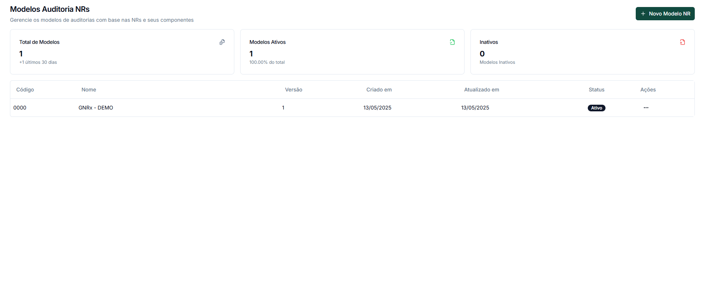
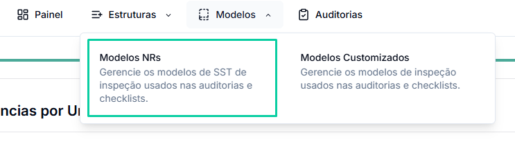
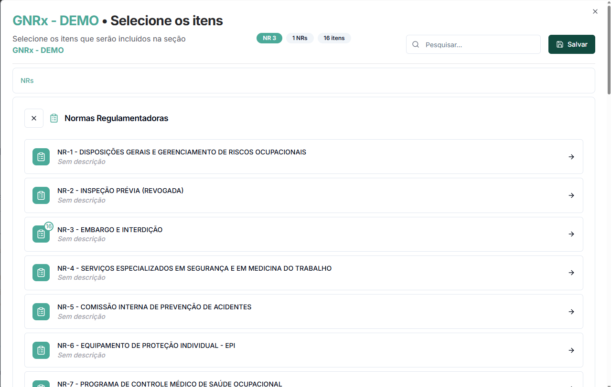
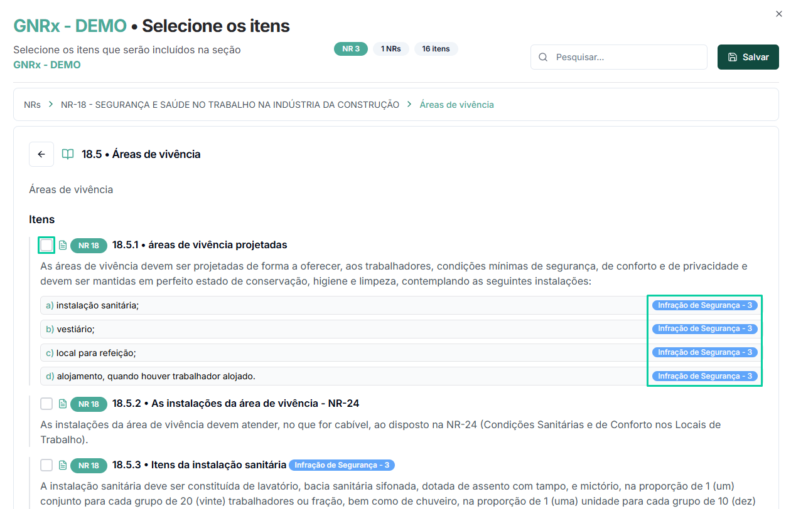
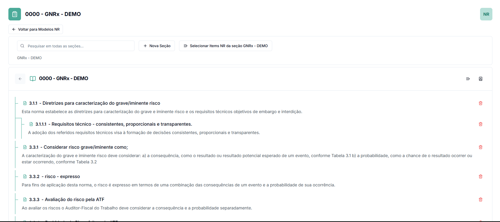
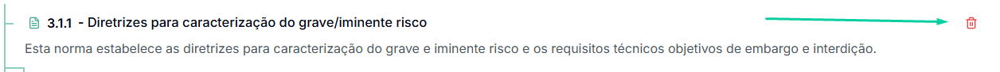

# Modelos NR

Os Modelos NR (Normas Regulamentadoras) permitem realizar auditorias em conformidade com a legislação trabalhista brasileira, oferecendo uma biblioteca completa de requisitos legais para verificação.

## O que são Modelos NR?

Modelos NR são checklists pré-configurados baseados nas Normas Regulamentadoras oficiais do Ministério do Trabalho. Eles oferecem:

* Estrutura exata com os textos normativos originais
* Organização hierárquica de itens e subitens conforme a norma
* Classificação automática do tipo e nível de infração
* Indicação de potencial de multa e valores correspondentes

## Biblioteca de Normas Disponíveis

O sistema GNRX disponibiliza uma biblioteca completa das Normas Regulamentadoras, incluindo:

| NR           | Título                                                      | Foco                                              |
| ------------ | ----------------------------------------------------------- | ------------------------------------------------- |
| NR-1         | Disposições Gerais e Gerenciamento de Riscos Ocupacionais   | Diretrizes básicas para todas as empresas         |
| NR-3         | Embargo e Interdição                                        | Procedimentos e critérios para embargo/interdição |
| NR-4         | Serviços Especializados em Segurança e Medicina do Trabalho | Requisitos para SESMT                             |
| NR-5         | Comissão Interna de Prevenção de Acidentes                  | Requisitos para CIPA                              |
| NR-6         | Equipamento de Proteção Individual - EPI                    | Seleção e uso de EPIs                             |
| NR-18        | Segurança e Saúde no Trabalho na Indústria da Construção    | Requisitos específicos para obras                 |
| (demais NRs) |                                                             |                                                   |

## Criando um Novo Modelo NR

### Passo 1: Acesso à área de Modelos

1. No menu superior, clique em **"Modelos"**
2. Selecione a opção **"Modelos NRs"** no submenu que aparece

### Passo 2: Iniciar novo modelo

1. Clique no botão para criar um novo modelo
2. Preencha as informações básicas:
   * Nome do modelo
   * Descrição (opcional)
   * Opções de configuração como permitir fotos e observações

### Passo 3: Selecionar itens da biblioteca de NRs

1. Clique em **"Selecionar Itens NR"**
2. Na janela que abrir, você verá a lista completa das Normas Regulamentadoras
3. Navegue e selecione a NR desejada (ex: NR-3, NR-18)

### Passo 4: Explorar e selecionar itens específicos

1. Após selecionar uma NR, o sistema exibirá os itens e subitens disponíveis
2. Navegue pela estrutura hierárquica da norma
3. Selecione os itens específicos que deseja incluir no seu modelo
4. Observe as classificações de infração já pré-definidas (ex: "Infração de Segurança - 3")

### Passo 5: Finalizar e salvar o modelo

1. Após selecionar todos os itens desejados, verifique a contagem de itens no topo da janela
2. Clique no botão **"Salvar"** para confirmar a inclusão dos itens
3. Finalize a criação do modelo com as configurações adicionais desejadas

## Estrutura dos Itens NR

Cada item das Normas Regulamentadoras no sistema possui:

* **Código e numeração oficial**: Seguindo a estrutura da norma (ex: 18.9.1)
* **Texto completo**: Exatamente como consta na legislação
* **Classificação de infração**: Tipo (Segurança, Saúde, etc.) e nível (1 a 4)
* **Subitens**: Quando aplicável, com detalhamento das alíneas

Como mostrado na Imagem 3, os itens específicos (como 18.9.1 a 18.9.4) exibem:

* Texto normativo completo
* Classificação da infração (ex: "Infração de Segurança - 3")
* Estrutura de subitens onde aplicável (como no item 18.9.2)

## Gerenciamento de Modelos NR

### Visualização e edição de modelo existente

1. Na lista de modelos NR, clique no modelo que deseja visualizar
2. Você verá a estrutura completa como na Imagem 1, com:
   * Código e nome de cada item
   * Descrição completa dos requisitos
   * Estrutura hierárquica (itens, subitens, alíneas)

### Adição de novos itens a um modelo existente

1. Em um modelo existente, clique no botão **"Selecionar Itens NR"**
2. Navegue pela biblioteca de NRs e selecione itens adicionais
3. Salve as alterações para atualizar o modelo

### Remoção de itens

Para remover itens que não são relevantes para sua operação:

1. Localize o item no modelo
2. Clique no ícone de lixeira (🗑️) ao lado do item

<figure><figcaption>
Exclusão do item
</figcaption></figure>

3. Confirme a remoção quando solicitado

<figure><figcaption></figcaption></figure>

## Atualizações Automáticas

O sistema GNRx mantém a biblioteca de NRs atualizada conforme as mudanças na legislação:

* Normas revogadas são marcadas como tal (ex: "NR-2 - INSPEÇÃO PRÉVIA (REVOGADA)")
* Novos textos normativos são incorporados automaticamente
* Modificações em requisitos existentes são atualizadas

## Dicas de Utilização

* 💡 **Dica 1**: Crie modelos específicos para diferentes áreas de sua empresa, selecionando apenas as NRs relevantes para cada operação
* 💡 **Dica 2**: Observe a classificação de infração dos itens para priorizar os mais críticos

## Próximos Passos

* [Criar uma auditoria utilizando modelo NR](criar-auditoria.md)
* [Gerar relatórios de conformidade legal](relatorio-auditoria.md)
* [Emitir planos de ação para não conformidades](emitir-plano-acao.md)
