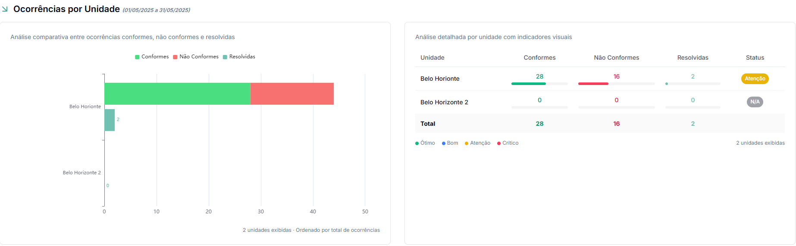
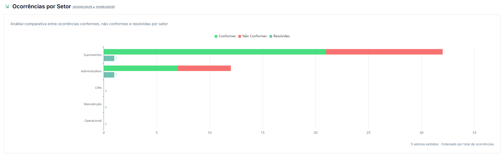
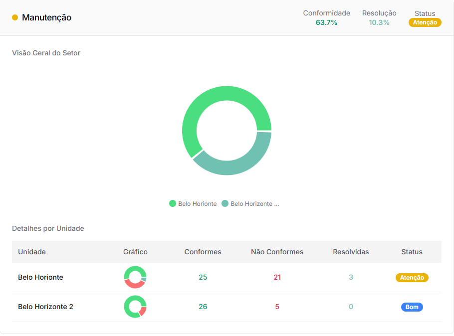

# Painel (Dashboard)

O Painel de Controle é a central de informações do GNRX Auditorias, proporcionando uma visão geral instantânea do status de conformidade da empresa.

## Visão Geral

No Dashboard, você encontra os principais indicadores de desempenho:

* **Índice de Conformidade** geral da empresa
* **Status por Setor** (Crítico, Atenção, Bom, Ótimo)
* **Status por Unidade** (Crítico, Atenção, Bom, Ótimo)
* **Status por Setores em Cada Unidade** (Crítico, Atenção, Bom, Ótimo)
* **Auditorias por Usuário** para acompanhamento de metas
* **Auditorias Conformes e Não Conformes** por unidade

## Gráficos Interativos

Os gráficos interativos permitem análise aprofundada:

#### Conformidade por Unidade

<figure><figcaption>
Gráfico de Ocorrência por Unidade
</figcaption></figure>

#### Conformidade por Setor

<figure><figcaption>
Gráfico de Ocorrência por Unidade
</figcaption></figure>

#### Conformidade por Setor / Unidade

<figure><figcaption>
Gráfico de Ocorrência por Unidade
</figcaption></figure>

## Filtros Disponíveis

Personalize a visualização do Dashboard com os filtros:

* **Período**: Últimos 7 dias, 30 dias, 3 meses, 6 meses, 12 meses, Customizado
* **Tipo de Checklist**: Customizado, NR, Todos
* Modelo de Checklist: Visualize todas as informações de um modelo específico

## Dicas de Utilização

* 💡 **Dica 1**: Utilize o dashboard no início do dia para identificar prioridades
* 💡 **Dica 2**: Configure alertas para índices críticos de conformidade
* 💡 **Dica 3**: Compartilhe prints do dashboard em reuniões gerenciais para acompanhamento

## Próximos Passos

A partir do Dashboard, você pode:

* [Criar uma nova auditoria](nova-auditoria.md)
* [Visualizar auditorias existentes](visualizar-auditorias.md)
* [Emitir planos de ação](criar-planos-acao.md)
