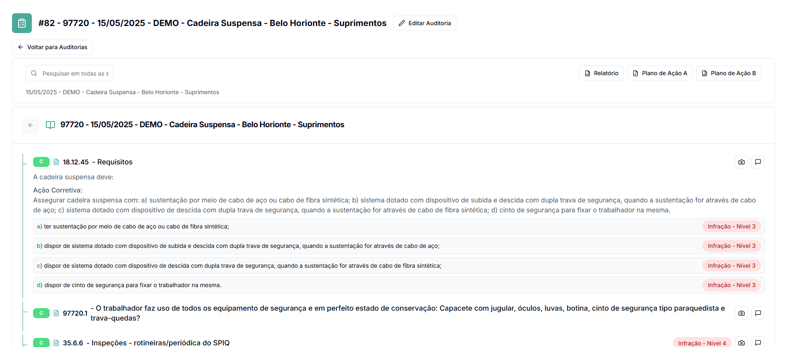
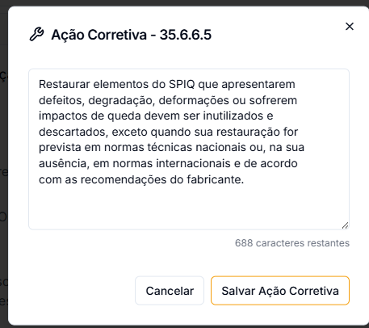
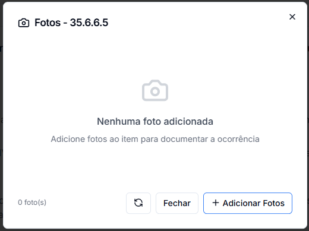
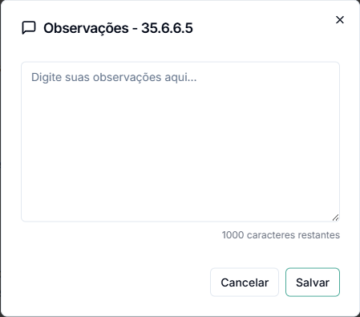

# Preencher Auditoria

Após criar uma auditoria no sistema web GNRX Auditorias, você deve preencher os itens do checklist avaliando cada requisito. Este guia explica como realizar esse preenchimento, desde a navegação até a avaliação de conformidade dos itens.

## Visão Geral da Tela de Preenchimento

A interface de preenchimento de auditoria no sistema web contém os seguintes elementos:

1. **Cabeçalho**: Exibe o código e nome da auditoria, com informações como data e local
2. **Menu de Navegação**: No lado esquerdo, permite navegar entre diferentes seções da auditoria
3. **Lista de Itens**: Área principal que mostra os itens a serem verificados
4. **Indicadores de Conformidade**: Mostram o status de cada item (Conforme, Não Conforme, Não Aplicável)
5. **Ferramentas de Evidência**: Opções para adicionar fotos e observações

## Tipos de Itens e Como Preenchê-los

O sistema oferece diversos tipos de itens para diferentes necessidades de verificação:

### Conformidade

Este é o tipo mais comum, onde você avalia se o item atende aos requisitos:

* **Conforme (C)**: Representado por um ícone verde, indica que o item atende completamente aos requisitos
* **Não Conforme (NC)**: Representado por um ícone vermelho, indica que o item não atende aos requisitos
* **Não Aplicável (NA)**: Representado por um ícone cinza, indica que o item não se aplica à situação atual
* **Resolvido (OK)**: Representado por um ícone verde, indica que o item foi corrigido
  1. Após marcar um item como Não Conforme, um botão adicional "Resolvido" aparecerá
  2. Ao clicar neste botão, o sistema indicará que a não conformidade foi corrigida
  3. O item continuará registrado como uma não conformidade inicial, mas com status de resolução

Para alterar o status de conformidade:

1. Clique no botão correspondente ao status desejado (C, NC ou NA)
2. O sistema salvará automaticamente sua seleção
3. O ícone à esquerda do item mudará para refletir o status selecionado

O sistema suporta diversos outros tipos de itens para coleta de informações específicas:

### Peso / Nota

* Permite atribuir uma nota numérica dentro de uma escala pré-definida
* Clique no valor desejado para selecionar a nota

### Informação

* Apenas exibe texto informativo, sem necessidade de resposta
* Fornece contexto ou instruções para o auditor

### Texto

* Campo para entrada de texto livre
* Clique no campo e digite a informação necessária

### Número

* Campo específico para valores numéricos
* O sistema aceita apenas números neste campo

### Temperatura

* Para registro de temperaturas em graus Celsius
* Inclui formatação automática com o símbolo °C

### Data

* Campo para seleção de datas específicas
* Clique no ícone de calendário para selecionar a data desejada

### Hora

* Para registro de horários
* Clique no ícone de relógio para selecionar a hora

## Adicionando Ação Corretiva

Uma funcionalidade importante do sistema web é a possibilidade de registrar ações corretivas para itens não conformes:

1. Para itens marcados como Não Conforme, localize o ícone de chave inglesa (🔧) ao lado direito do item
2. Clique na engrenagem para abrir as opções adicionais
3. Selecione "Adicionar Ação Corretiva"
4. Digite a descrição detalhada da ação corretiva recomendada
5. Clique em "Salvar" para registrar a ação corretiva


As ações corretivas são particularmente importantes para a geração de planos de ação posteriores, pois serão incluídas automaticamente como recomendações.


## Adicionando Evidências

### Fotos e Imagens

Para adicionar evidências fotográficas a um item:

1. Localize o ícone de câmera (📷) ao lado direito do item
2. Clique neste ícone para abrir o modal de fotos
3. Clique em "+ Adicionar Fotos"
4. Escolha uma imagem ou várias imagens do seu computador
5. Confirme, o item será enviado.

_Observação: Pode acontecer de demorar para exibir a foto. Clique no botão de recarregar caso ocorra algum delay._

<figure><figcaption></figcaption></figure>

### Observações

Para adicionar comentários ou informações adicionais:

1. Clique no ícone de comentário (💬) ao lado direito do item
2. Digite o texto na caixa de observações que aparecerá
3. Clique no botão "Salvar"
4. Uma indicação visual (borda colorida) aparecerá mostrando que o item possui observações

<figure><figcaption></figcaption></figure>

## Informações de Infração

Para itens baseados em Normas Regulamentadoras (NR), o sistema exibe automaticamente o nível de infração:

* **Infração - Nível 1**: Indica uma infração leve
* **Infração - Nível 2**: Indica uma infração média
* **Infração - Nível 3**: Indica uma infração grave
* **Infração - Nível 4**: Indica uma infração gravíssima

Estas informações são importantes para priorização de ações corretivas e cálculo de potencial de multas.

## Progresso e Finalização

### Acompanhamento de Progresso

Durante o preenchimento, você pode acompanhar seu progresso de duas formas:

1. **Contador de itens**: No topo da página, indica quantos itens já foram respondidos do total
2. **Indicadores visuais**: Os itens já respondidos apresentam ícones coloridos, enquanto os pendentes não apresentam indicadores

### Salvamento Automático

O sistema web salva automaticamente suas respostas à medida que você preenche os itens, permitindo:

* Pausar e retomar o preenchimento a qualquer momento
* Trabalhar em diferentes sessões sem perda de dados
* Segurança contra perda de informações por problemas de conexão

## Continuando uma Auditoria em Andamento

Para retomar o preenchimento de uma auditoria salva:

1. Na lista de auditorias, localize a auditoria com status "Em Andamento"
2. Clique sobre o nome da auditoria para abri-la
3. O sistema abrirá a interface de preenchimento no ponto onde você parou
4. Continue o preenchimento normalmente

## Dicas para um Preenchimento Eficiente

* **Utilize atalhos de teclado**: Tab para avançar entre itens, espaço para selecionar opções
* **Siga uma sequência lógica**: Complete uma seção por vez, na ordem apresentada
* **Documente adequadamente**: Adicione fotos e observações detalhadas, especialmente para não conformidades
* **Adicione ações corretivas**: Inclua recomendações claras para todos os itens não conformes
* **Revise antes de finalizar**: Verifique todas as respostas antes de concluir a auditoria

## Próximos Passos

Após concluir o preenchimento da auditoria, você pode:

* [Visualizar o relatório completo](relatorio-auditoria.md)
* [Emitir planos de ação](emitir-plano-acao.md)
* [Gerenciar suas auditorias](auditorias.md)
