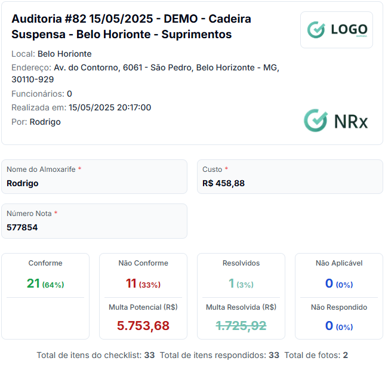
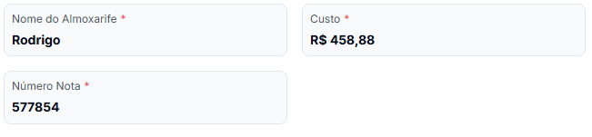
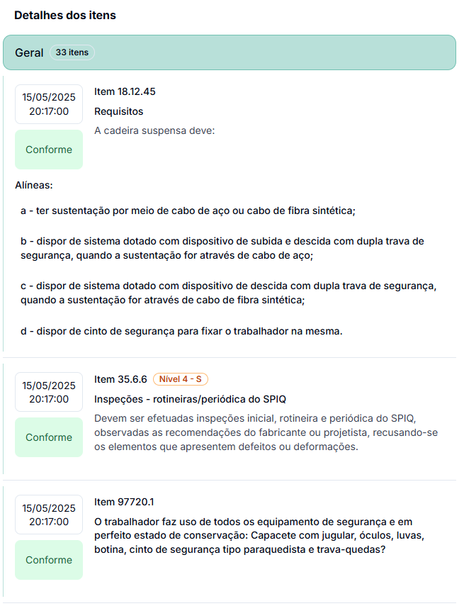
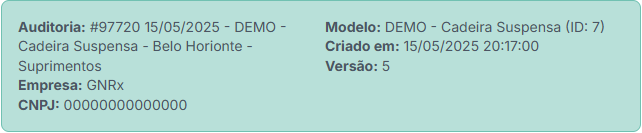

# Relatório de Auditoria

O Relatório de Auditoria oferece uma visão completa e detalhada dos resultados da verificação, permitindo análise aprofundada, compartilhamento com stakeholders e tomada de decisões baseadas em evidências.

## Acessando o Relatório

Para visualizar o relatório de uma auditoria:

1. Acesse a lista de auditorias no menu principal
2. Localize a auditoria desejada
3. Clique no botão **"Relatório"** na linha da auditoria
   * Alternativa: Abra a auditoria e clique no botão **"Relatório"** no topo da página

## Estrutura do Relatório

### Cabeçalho e Informações Gerais

Na parte superior do relatório, você encontra as informações de identificação:

* **Título da Auditoria**: Nome, código e descrição
* **Local**: Unidade onde foi realizada a auditoria
* **Endereço**: Localização física detalhada
* **Data e Hora**: Quando a auditoria foi realizada
* **Responsável**: Nome de quem conduziu a auditoria
* **Logo**: Identificação visual da empresa

### Informações do Cabeçalho da Auditoria

Exibe os dados coletados nos campos de cabeçalho configurados no modelo:\
Exemplos:

* Nome do Almoxarife
* Custo
* Número da Nota
* Outros campos específicos do modelo

### Resumo dos Resultados

Um dashboard visual apresenta os principais indicadores de desempenho:

* **Conformes**: Número e percentual de itens em conformidade
* **Não Conformes**: Número e percentual de itens em não conformidade
* **Resolvidos**: Itens não conformes que já foram corrigidos
* **Não Aplicáveis**: Itens que não se aplicam ao contexto verificado

Quando há items de nota/peso, o relatório exibirá também:

* **Nota Final**: Valor obtido na avaliação

Informações adicionais incluem:

* **Multa Potencial**: Valor estimado de multas para itens não conformes
  * A Multa para NRs é calculada com base no tipo de infração, nível e quantidade de colaboradores da unidade
* **Multa Resolvida**: Valor de multas já evitadas pela correção
* **Total de itens**: Quantidade de verificações realizadas
* **Total de fotos**: Número de evidências fotográficas


Quando o modelo de auditoria utiliza sistema de pontuação ou notas, o relatório exibirá também a nota final obtida na avaliação.


### Tabela Resumo por Seção

Uma tabela organizada apresenta o desempenho por seção do checklist:

| SEÇÃO | ITENS | RESPONDIDOS | CONFORME | OK% | NÃO CONFORME | NÃO APLICA |
| ----- | ----- | ----------- | -------- | --- | ------------ | ---------- |
| Geral | 33    | 33          | 21       | 64% | 11           | 0          |
| Total | 33    | 33          | 21       | 64% | 11           | 0          |

### Lista Detalhada de Itens

O relatório exibe todos os itens verificados durante a auditoria, organizados cronologicamente:

Cada item apresenta:

* **Data e hora** da verificação
* **Código e nome** do item verificado
* **Status**: Conforme, Não Conforme ou Não Aplicável
* **Nível de infração** (para itens de NR): Por exemplo, "Nível 3 - S"
  * Nível de 1 a 4 (1 é o mais baixo)
  * S = Segurança | M = Médica
* **Ação corretiva recomendada** para itens não conformes
* **Evidências fotográficas** (quando disponíveis)
* **Observações** registradas pelo auditor

### Assinaturas e Localização

Na parte inferior do relatório, são exibidas informações adicionais:

* **Localização geográfica** onde a auditoria foi realizada
* **Assinaturas digitais** dos responsáveis pela auditoria

### Metadados da Auditoria

O relatório também inclui informações técnicas sobre a auditoria:

* **Modelo utilizado**: Nome e ID do modelo de checklist
* **Empresa**: Razão social e CNPJ
* **Versão**: Número da versão do modelo aplicado
* **Data de criação**: Quando o modelo foi originalmente criado

## Exportação do Relatório

Para salvar e compartilhar o relatório:

1. Clique no botão **"Baixar Relatório PDF"** no topo da página
2. O sistema gerará um arquivo PDF com todos os elementos do relatório
3. Salve o arquivo em seu dispositivo ou compartilhe diretamente

O PDF gerado mantém a formatação visual e todos os elementos do relatório online, sendo ideal para:

* Compartilhar com gestores e stakeholders
* Arquivamento para fins de comprovação
* Impressão de cópias físicas quando necessário

## Análise e Interpretação

### Identificação de Prioridades

Itens não conformes são destacados visualmente para fácil identificação:

* Marcados em vermelho
* Apresentam o nível de infração (quando aplicável)
* Incluem ações corretivas recomendadas para NRs.

### Cálculo de Conformidade

O percentual de conformidade é calculado automaticamente:

* Total de itens conformes ÷ Total de itens respondidos e aplicáveis × 100
* Exemplo: 21 itens conformes ÷ 33 itens respondidos e aplicáveis = 64% de conformidade

### Avaliação de Riscos Financeiros

O relatório apresenta uma estimativa dos valores de potenciais multas:

* **Multa Potencial**: Soma dos valores de multa para todos os itens não conformes
* **Multa Resolvida**: Valor das multas evitadas pela correção dos itens

## Acompanhamento e Próximos Passos

Após a análise do relatório, recomenda-se:

1. **Priorizar ações corretivas** com base na criticidade e valor de multa
2. **Criar planos de ação** para tratar as não conformidades identificadas
3. **Programar auditorias de follow-up** para verificar a eficácia das ações
4. **Compartilhar os resultados** com as equipes relevantes

## Dicas de Utilização

* 💡 **Dica 1**: Revise os itens com maior nível de infração (Nível 3 ou superior) primeiro
* 💡 **Dica 2**: Utilize o PDF exportado para reuniões de análise crítica
* 💡 **Dica 3**: Compare os resultados com auditorias anteriores para verificar evolução
* 💡 **Dica 4**: Atente ao valor total de multas potenciais para justificar investimentos em melhorias

## Próximos Passos

* [Emitir plano de ação para não conformidades](emitir-plano-acao.md)
* [Criar nova auditoria para verificação](criar-auditoria.md)
* [Visualizar todas as auditorias](auditorias.md)
