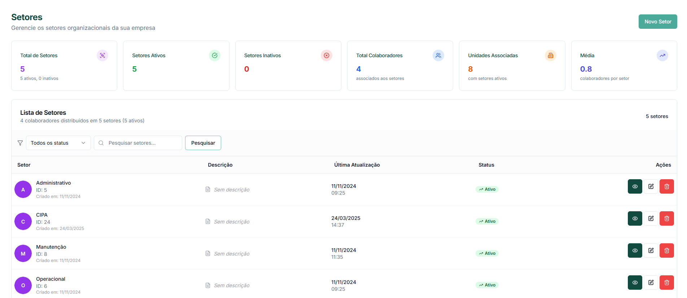

# Criar Cargo

Esta página explica como adicionar um novo cargo no Sistema GNRX Gestão de EPI.

## Visão Geral

A criação de cargos permite definir as diferentes funções existentes na empresa, facilitando a organização dos colaboradores e a atribuição padronizada de EPIs conforme as atividades exercidas.

## Acessando a Tela de Criação

Para iniciar o cadastro de um novo cargo:

1. No menu lateral, clique em **Estruturas**
2. Selecione **Cargos**
3. Na tela de listagem, clique no botão **Novo cargo** no canto superior direito

<figure><figcaption>
Botão novo cargo
</figcaption></figure>

## Formulário de Cadastro

Ao clicar em "Novo cargo", o sistema exibirá um modal com o formulário de criação:

<figure><figcaption></figcaption></figure>

### Campos do Formulário

| Campo    | Descrição     | Obrigatoriedade | Exemplo                  |
| -------- | ------------- | --------------- | ------------------------ |
| **Nome** | Nome do cargo | Obrigatório     | "Auxiliar de Manutenção" |

O formulário é intencionalmente simples, contendo apenas o campo para o nome do cargo. Isso facilita o cadastro rápido e eficiente das funções da empresa.

## Preenchendo o Formulário

1. Digite o **Nome** do cargo
   * Use nomenclatura clara e padronizada
   * Mantenha consistência com a terminologia utilizada em documentos oficiais
   * Utilize nomes que identifiquem claramente a função (ex: "Auxiliar de Escritório" em vez de apenas "Auxiliar")
2. Revise a informação inserida
3. Clique no botão **Salvar** para criar o cargo

## Após a Criação

Quando um novo cargo é criado com sucesso:

1. O sistema exibe uma mensagem de confirmação
2. O cargo é adicionado à lista de cargos
3. O novo cargo fica disponível para seleção em outros módulos do sistema, como o cadastro de colaboradores

Melhorando o Cadastro

Embora o formulário de criação seja simples, é importante considerar os seguintes aspectos ao cadastrar um novo cargo:

### Padronização de Nomenclatura

* Utilize a mesma nomenclatura presente em documentos oficiais da empresa
* Mantenha um padrão consistente (ex: "Auxiliar de...", "Técnico em...", "Gerente de...")
* Evite abreviações que possam gerar confusão
* Considere incluir o nível ou grau, quando aplicável (ex: "Técnico em Segurança Júnior")

### Alinhamento com Áreas Relacionadas

Antes de criar novos cargos, consulte:

* Departamento de Recursos Humanos
* Documentos de SST (PPRA, PCMSO, PGR)
* Organograma institucional
* Descrições de cargo existentes

## Considerações Importantes

* A criação de um cargo é apenas o primeiro passo - ele precisa ser associado a colaboradores para ser efetivamente utilizado
* O nome do cargo deve refletir claramente a função na organização
* Cargos bem estruturados facilitam a análise de conformidade e a gestão de EPIs
* Evite a criação de cargos muito específicos ou excessivamente genéricos

## Casos de Uso Comuns

Situações típicas para criação de novos cargos:

* Contratação de colaboradores em novas funções
* Reestruturação organizacional
* Adequação a novas regulamentações
* Padronização de nomenclatura

## Erros Comuns e Soluções

| Erro                | Solução                                                              |
| ------------------- | -------------------------------------------------------------------- |
| "Nome já existe"    | Escolha um nome único ou verifique se o cargo já existe com outro ID |
| "Campo obrigatório" | Certifique-se de preencher o nome do cargo                           |
| Erro ao salvar      | Verifique se há caracteres especiais não permitidos no nome          |

## Próximos Passos

Após criar um novo cargo, considere:

1. [Associar colaboradores](../colaboradores/) ao cargo recém-criado

***

_Última atualização: 16 de Maio de 2025_
