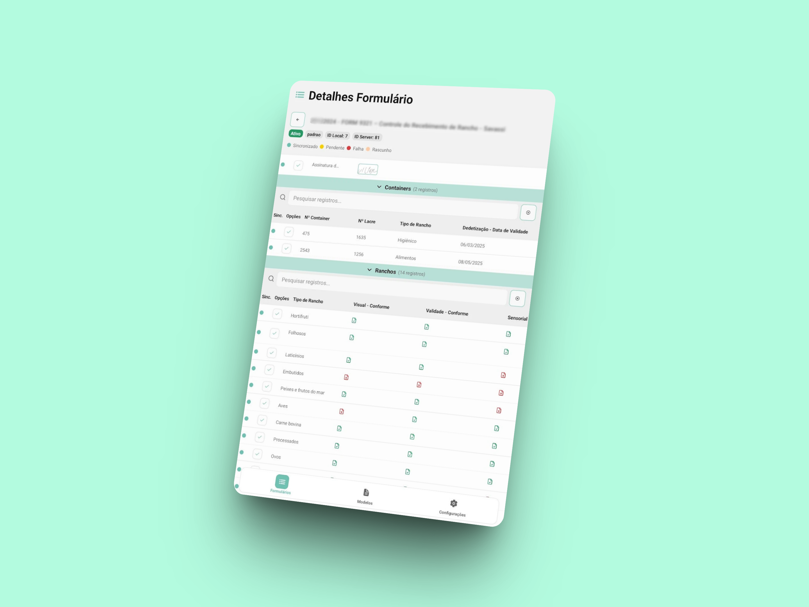

# Introdução aos Formulários

O módulo de Formulários GNRx é uma solução completa para criação, gestão e preenchimento de formulários customizados para coleta de dados operacionais. Desenvolvido para atender às necessidades específicas de empresas que precisam digitalizar processos de coleta de informações, o sistema oferece uma abordagem moderna e flexível para captura e análise de dados estruturados.

<figure><figcaption></figcaption></figure>

## Visão Geral do Módulo

O módulo de Formulários GNRx permite gerenciar todo o ciclo de vida dos formulários:

* **Criação de modelos personalizados** de formulários adaptados às necessidades da sua empresa
* **Configuração de campos dinâmicos** com diferentes tipos de dados e validações
* **Preenchimento de registros em campo** com suporte offline
* **Gestão de dados globais** compartilhados entre o formulário
* **Geração do formulário em PDF**

## Plataformas Disponíveis

O sistema GNRx Formulários está disponível em duas plataformas complementares:

### Sistema Web

O sistema web é a plataforma central, acessível através de qualquer navegador moderno, onde você pode:

* Criar e gerenciar modelos de formulários
* Configurar campos, seções e validações
* Visualizar todos os registros e dados coletados
* Analisar dados e gerar relatórios avançados
* Configurar e administrar o sistema
* Gerenciar usuários e permissões

### Aplicativo Mobile

O aplicativo mobile está disponível para dispositivos Android, permitindo:

* Preencher formulários em campo, mesmo sem conexão à internet
* Sincronizar dados automaticamente quando conectado
* Acessar formulários baseados em modelos pré-configurados

> **INTEGRAÇÃO PERFEITA**: As duas plataformas trabalham em sincronia, permitindo configurar modelos no sistema web, preenchê-los em campo com o aplicativo, e depois analisar os dados novamente no sistema web.

## Principais Benefícios

### Digitalização Completa

* **Eliminação de papel**: Substituição de formulários físicos por versões digitais
* **Coleta padronizada**: Estruturas consistentes para toda a organização
* **Validação automática**: Prevenção de erros através de regras de negócio
* **Backup automático**: Proteção contra perda de dados

### Flexibilidade Total

* **Campos customizáveis**: Adaptação completa às necessidades específicas
* **Tipos de dados variados**: Texto, números, datas, seleções, etc.
* **Máscaras e validações**: Controle de formato e integridade dos dados
* **Seções organizadas**: Estruturação lógica para facilitar o preenchimento

### Gestão Inteligente

* **Dados globais**: Informações compartilhadas entre múltiplos formulários
* **Controle de versões**: Rastreamento de alterações em modelos
* **Relatórios dinâmicos**: Análise visual e exportação de dados
* **Sincronização automática**: Trabalho offline com upload posterior

## Fluxo de Trabalho Típico

O fluxo de trabalho padrão no módulo de Formulários GNRx segue estas etapas:

1. **Planejamento**: Definição dos dados a serem coletados e estrutura do modelo do formulário
2. **Criação do Modelo**: Configuração de campos, seções e validações no sistema web
3. **Preenchimento**: Coleta de dados através do aplicativo mobile ou sistema web
4. **Sincronização**: Upload automático dos dados para o servidor
5. **Análise**: Visualização e análise dos dados coletados
6. **Relatórios**: Geração do pdf para para análise interna

## Tipos de Formulários Suportados

O sistema GNRx Formulários é versátil e pode ser utilizado para diversos tipos de coleta de dados:

* **Controle de Qualidade**: Verificações de produtos e processos
* **Registros Operacionais**: Dados de produção e operação
* **Controles Ambientais**: Monitoramento de condições ambientais
* **Inspeções de Equipamentos**: Registros de manutenção e funcionamento
* **Coleta de Temperaturas**: Controle de câmaras e equipamentos
* **Registros de Recebimento**: Controle de materiais e produtos
* **Formulários Customizados**: Qualquer necessidade específica da empresa

## Recursos Principais

### Modelos Personalizáveis

Crie formulários completamente adaptados às necessidades específicas da sua operação:

* Editor intuitivo com campos arrastar-e-soltar
* Suporte a diferentes tipos de campos (texto, número, data, seleção, etc.)
* Organização em seções para melhor navegação
* Configuração de máscaras e validações
* Campos obrigatórios e opcionais
* Versionamento para controle de alterações

.png>)

### Tipos de Campos Disponíveis

O sistema oferece diversos tipos de campos para diferentes necessidades:

* **Texto**: Campos de texto livre ou com máscara
* **Número**: Campos numéricos com validação
* **Data**: Seletor de data com calendário
* **Seleção**: Dropdown com opções pré-definidas
* **Múltipla Escolha**: Seleção de múltiplas opções
* Sim/Não: Campos sim/não ou verdadeiro/falso
* **Conformidade:** Campos de conforme e não conforme
* **Temperatura:** Encaixa para temperaturas, adiciona o ºC ao fim.
* **Foto**: Permite o anexo de uma foto
* **Assinatura**: Recolhe a assinatura do usuário, digital

### Estados de Formulários

Controle completo do ciclo de vida dos formulários:

* **Ativo**: Formulário disponível para preenchimento
* **Inativo**: Formulário temporariamente desabilitado

### Sincronização e Offline

Funcionalidade robusta para trabalho sem conexão:

* **Preenchimento offline**: Coleta de dados sem internet
* **Sincronização automática**: Upload quando conectado
* **Indicadores visuais**: Status claro de sincronização
* **Resolução de conflitos**: Tratamento de dados divergentes

### Relatórios e Análises

Ferramentas avançadas para visualização e compartilhamento de dados:

* **Exportação múltipla**: PDF, Excel.

## Estados de Sincronização de registros

O sistema utiliza indicadores visuais claros para o status dos dados:

* 🟢 **Sincronizado**: Dados seguros no servidor
* 🟡 **Pendente**: Aguardando sincronização
* 🔴 **Falha**: Erro na sincronização
* 🟠 **Rascunho**: Dados salvos localmente

## Níveis de Acesso e Permissões

O sistema permite configurar diferentes níveis de acesso conforme as responsabilidades:

* **Administrador**: Configuração completa do sistema e gestão de usuários
* **Gestor**: Criação de modelos e visualização de todos os formulários
* **Supervisor**: Gestão de formulários específicos e análise de dados
* **Operador**: Preenchimento de registros e visualização básica
* **Customizados**: A Empresa define os acessos

## Requisitos Técnicos

### Sistema Web

* **Navegadores compatíveis**: Chrome, Firefox, Safari, Edge (versões recentes)
* **Resolução mínima**: 1280x720 pixels
* **Conexão**: Internet banda larga recomendada

### Aplicativo Mobile

* **Dispositivos Android**: Android 11.0 ou superior
* **Espaço em disco**: Mínimo 100 MB disponíveis
* **RAM**: Mínimo 2 GB recomendado
* **Conectividade**: WiFi ou dados móveis (3G/4G/5G)

## Principais Casos de Uso

### Controle de Qualidade

* Registros de verificação de produtos
* Controle de processos produtivos
* Inspeções de qualidade

### Monitoramento Operacional

* Controle de temperaturas
* Registros de recebimento
* Verificações de equipamentos

### Gestão de Processos

* Formulários de procedimentos
* Registros de atividades
* Controles diversos

## Próximos Passos

Agora que você conhece os fundamentos do módulo de Formulários GNRx, explore as seções específicas deste manual para aprender a utilizá-lo em todo seu potencial:

* [Aplicativo Mobile de Formulários](aplicativo/)
* [Sistema Web de Formulários](web/)

## Suporte e Contato

Para dúvidas, suporte técnico ou solicitação de novas funcionalidades:

* **Email**: contato@nrxgestao.com.br
* **Site**: www.gnrx.com.br

***

_Manual atualizado para a versão atual do sistema GNRx Formulários_
