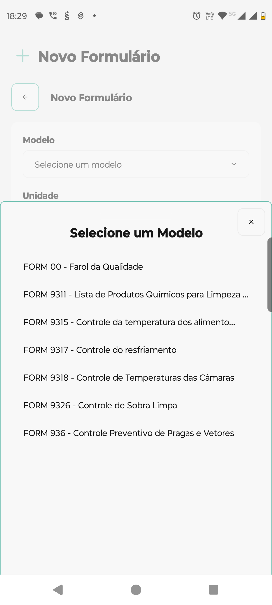
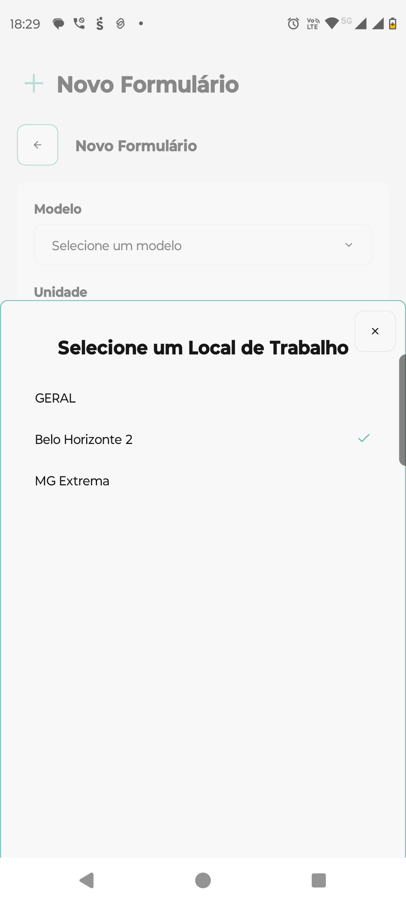

# Introdução ao Aplicativo

## Aplicativo Mobile

***

## Índice

1. [Introdução](./#introducao)
2. [Primeiros Passos](./#primeiros-passos)
3. [Navegação Principal](./#navegacao-principal)
4. [Meus Formulários](./#meus-formularios)
5. [Criando um Novo Formulário](./#criando-novo-formulario)
6. [Detalhes do Formulário](./#detalhes-formulario)
7. [Registros](./#registros)
8. [Estados e Status](./#estados-status)
9. [Sincronização](./#sincronizacao)

***

## 1. Introdução 

O **GNRx Formulários** é um aplicativo mobile que permite criar, gerenciar e preencher formulários personalizados diretamente do seu dispositivo móvel. O app funciona tanto online quanto offline, garantindo que você nunca perca dados importantes.

### Principais Funcionalidades

* ✅ Criação de formulários baseados em modelos
* ✅ Preenchimento offline com sincronização automática
* ✅ Diferentes tipos de campos (texto, data, seleção, etc.)
* ✅ Controle de status e validações
* ✅ Interface intuitiva e responsiva

***

## 2. Primeiros Passos 

### Download e Instalação

O aplicativo está disponível na Google Play Store. Procure por **"GNRx - Forms"** ou acesse diretamente através do [link](https://play.google.com/store/apps/details?id=br.com.form.nrxgestao.app\&hl=pt\&pli=1).

### Login

Após a instalação, faça login com as credenciais fornecidas pelo administrador do sistema da sua empresa.

***

## 3. Navegação Principal 

O aplicativo possui uma barra de navegação inferior com três seções principais:

### 📋 Formulários

Visualize e gerencie todos os seus formulários

### 📄 Modelos

Acesse os modelos disponíveis para criar novos formulários

### ⚙️ Configurações

Ajustes do aplicativo e configurações da conta

***

## 4. Meus Formulários 

Na tela principal "Formulários", você encontra todos os formulários da sua empresa organizados por status.

### Status Disponíveis

* **Ativo**: Formulário disponível para preenchimento
* Concluído: Preenchimento Finalizado e Sincronizado

### Informações Exibidas

Para cada formulário, você vê:

* **Nome do formulário** (ex: "FORM 9321 - Controle do Recebimento de Rancho")
* **Status atual** (Ativo, Concluído)
* **Unidade** (ex: "Belo Horizonte 2")
* **Data de criação/atualização**
* **Tipo de formulário** (Padrão)

### Ações Disponíveis

Toque em qualquer formulário para acessar suas opções e detalhes.

***

## 5. Criando um Novo Formulário 

### Passo 1: Iniciar Criação

1. Toque no botão **"+ Novo"** na tela principal

### Passo 2: Selecionar Modelo

1.  Na tela "Selecione um Modelo", escolha entre os modelos disponíveis da sua empresa, ex:

    * FORM 00 - Farol da Qualidade
    * FORM 9311 - Lista de Produtos Químicos para Limpeza
    * FORM 9315 - Controle da temperatura dos alimentos
    * FORM 9317 - Controle do resfriamento
    * FORM 9318 - Controle de Temperaturas das Câmaras
    * FORM 9326 - Controle de Sobra Limpa
    * E outros conforme disponibilidade da empresa

<figure><figcaption></figcaption></figure>

### Passo 3: Selecionar Unidade

1.  Escolha o local onde o formulário será aplicado, Ex:

    * GERAL
    * Belo Horizonte 2
    * MG Extrema
    * Outros locais conforme sua empresa

<figure><figcaption></figcaption></figure>

### Passo 4: Configurar Formulário

1. **Nome do formulário**: Nome é preenchido automaticamente, se você preferir, digite um nome descritivo
2. **Descrição**: Adicione uma descrição opcional

### Passo 5: Cancelar ou Confirmar

* **Cancelar**: Retorna à tela anterior sem salvar
* **Criar Formulário**: Confirma a criação e abre o formulário

***

## 6. Detalhes do Formulário 

Ao acessar um formulário, você visualiza:

### Cabeçalho

* Nome (ex: "06062025 - FORM 00 - Farol da Qualidade - Belo Horizonte 2")
* **Status** (Ativo/Concluído)
* **Tipo** (padrão apenas)
* **IDs de controle** (Local e Server)

### Indicadores de Sincronização de Registros

* 🟢 **Sincronizado**: Dados salvos no servidor
* 🟡 **Pendente**: Aguardando sincronização
* 🔴 **Falha**: Erro na sincronização
* 🟠 **Rascunho**: Salvo localmente

### Seções Principais

#### 📊 Dados Globais

Informações únicas que compõem o formulário

#### 📊 Registros

Lista todos os registros preenchidos no formulário com os respectivos valores para cada coluna.

***

## 7. Registros 

### Visualizando Registros

Na seção "Registros", você pode:

* **Adicionar**: Toque no botão **"+"** para criar um novo registro
* Editar: Disponível quando em rascunho. Clicar no "Lápis" no início.

### Criando um Novo Registro

#### Passo 1: Escolher Ação

Ao tocar no botão **"+"**, vai abrir uma nova tela com as informações dos registros.

#### Passo 2: Preencher Campos Obrigatórios

Os campos marcados com \* são obrigatórios.

### Estados dos Registros

* **Pendente**: Registro salvo mas não sincronizado
* **Sincronizado**: Dados enviados com sucesso ao servidor
* **Erro**: Falha na sincronização
* **Rascunho**: Preenchimento em andamento

***

## 8. Estados e Status 

### Status de Sincronização

O aplicativo mostra claramente o status de cada item:

* **"ID Server: Não Sincronizado"**: Dados ainda não enviados ao servidor
* **"ID Server: \[número]"**: Dados sincronizados com ID do servidor
* **"Pendente"**: Aguardando conexão para sincronizar
* **"Falha"**: Erro durante a sincronização

### Indicadores Visuais

* 🟢 Verde: Tudo funcionando normalmente
* 🟡 Amarelo: Atenção necessária
* 🔴 Vermelho: Erro ou problema
* 🟠 Laranja: Status intermediário

***

## 9. Sincronização 

### Como Funciona

O aplicativo sincroniza quando o formulário for marcado como concluído. Ele às vezes sincroniza os modelos automaticamente, em plano de fundo. Mas, para garantir consistência. Pode usar o botão "Forçar Sincronização" nas configurações

***

## 10. Dicas e Boas Práticas 

### ✅ Boas Práticas

1. **Sempre preencha campos obrigatórios** (marcados com \*)
2. **Use nomes descritivos** para formulários e registros
3. **Mantenha o app atualizado** para ter as últimas funcionalidades
4. **Verifique a sincronização** regularmente
5. **Caso queira deixar algo para preencher posteriormente, salve como rascunho.**

### ⚠️ Cuidados Importantes

* **Não desinstale o app** com dados não sincronizados
* **Mantenha espaço livre** no dispositivo para salvar dados temporários
* **Use conexão estável** para sincronização de dados grandes
* **Respeite as permissões** de acesso aos formulários da sua empresa

### 🔧 Resolução de Problemas

#### Problema: App não sincroniza

**Solução**: Verifique sua conexão com a internet e tente novamente

#### Problema: Formulário não carrega

**Solução**: Feche e abra o app novamente, ou reinstale se necessário

#### Problema: Dados perdidos

**Solução**: Dados são salvos localmente primeiro. Verifique na seção de rascunhos

***

_Manual atualizado para versão atual do aplicativo GNRx Formulários_
